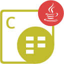

{} 

****

**Welcome to Aspose.Words for Android via Java**

Aspose.Words for Android via Java's ultimate goal is to bring all stunning features of Aspose.Words for Java to the Android platform that makes it possible to do native Android development in Java, with either Android Studio or any IDE that supports Android development. Aspose.Words for Android via Java is a class library that enables your native Android applications to perform a great range of document processing tasks. Aspose.Words for Android via Java supports DOC, DOCX, RTF, HTML, OpenDocument, PDF, XPS, EPUB and other formats. With Aspose.Words for Android via Java you can generate, modify, convert and render documents.

{}

## **Aspose.Words for Android via Java Resources**

The following are the links to some useful resources you may need to accomplish your tasks.

- [Aspose.Words for Java Online Documentation](https://docs.aspose.com/words/java/) - (**Aspose.Words for Android via Java** is very similar to **Aspose.Words for Java**. So, you can use the same documentation)
- [Aspose.Words for Android via Java Features](https://docs.aspose.com/words/java/aspose-words-for-android-via-java-features/)
- [Aspose.Words for Android via Java Limitations and API Differences](https://docs.aspose.com/words/java/aspose-words-for-android-via-java-limitations-and-api-differences/)
- [Aspose.Words for Android via Java Release Notes](https://docs.aspose.com/words/java/aspose-words-for-android-via-java/)
- [Aspose.Words for Android via Java Product Page](https://products.aspose.com/words/android-java/)
- [Download Aspose.Words for Android via Java](https://repository.aspose.com/webapp/#/artifacts/browse/tree/General/repo/com/aspose/aspose-words)
- [Install Aspose.Words for Android via Java from Maven](https://docs.aspose.com/words/java/install-aspose-words-for-android-via-java/#InstallAspose.WordsforAndroidviaJavafromMavenRepository)
- [Aspose.Words for Android via Java API Reference Guide](https://reference.aspose.com/words/java) - (**Aspose.Words for Android via Java** is very similar to **Aspose.Words for Java**. So, you can use the same API Reference Guide)
- [Aspose.Words for Android via Java Free Support Forum](https://forum.aspose.com/c/words/8)
- [Aspose.Words for Android via Java Paid Support Helpdesk](https://helpdesk.aspose.com/)

{} 

****

**Welcome to Aspose.PDF for Android via Java**

Aspose.PDF for Android via Java is a component that allows developers to create and manipulate PDF documents programmatically, whether simple or complex. Aspose.PDF for Android via Java allows developers to insert tables, graphs, images, hyperlinks, custom fonts - and more - into PDF documents. It can also be used to compress PDF documents. Aspose.PDF for Android via Java provides excellent security features for developing secure PDFs. Aspose.PDF for Android via Java's most distinctive feature is that it supports PDF creation through both an API and from XML templates.

{}

## **Aspose.PDF for Android via Java Resources**

The following are the links to some useful resources you may need to accomplish your tasks.

- [Aspose.PDF for Java Online Documentation](https://docs.aspose.com/pdf/java/) - (**Aspose.PDF for Android via Java** is very similar to **Aspose.PDF for Java**. So, you can use the same documentation)
- [Aspose.PDF for Android via Java Features](https://docs.aspose.com/pdf/androidjava/key-features/)
- [Aspose.PDF for Android via Java Release Notes](https://docs.aspose.com/pdf/androidjava/release-notes/)
- [Aspose.PDF for Android via Java Product Page](https://products.aspose.com/pdf/android-java/)
- [Download Aspose.PDF for Android via Java](https://repository.aspose.com/webapp/#/artifacts/browse/tree/General/repo/com/aspose/aspose-pdf-android-via-java)
- [Install Aspose.PDF for Android via Java](https://docs.aspose.com/pdf/java/installation/)
- [Aspose.PDF for Android via Java API Reference Guide](https://reference.aspose.com/pdf/java) - (**Aspose.PDF for Android via Java** is very similar to **Aspose.PDF for Java**. So, you can use the same API Reference Guide)
- [Aspose.PDF for Android via Java Free Support Forum](https://forum.aspose.com/c/pdf/10)
- [Aspose.PDF for Android via Java Paid Support Helpdesk](https://helpdesk.aspose.com/)

{} 

****

**Welcome to the Aspose.Cells for Android via Java**

Aspose.Cells for Android via Java is a flexible component that enables Android applications to create and manage Excel spreadsheets without requiring Microsoft Excel. Aspose.Cells for Android via Java's ultimate goal is to bring all stunning features of Aspose.Cells for Java to the Android platform that makes it possible to do native Android development in Java, with either Android Studio or any IDE that supports Android development. Aspose.Cells for Android via Java is a class library that enables your native Android applications to perform a great range of document processing tasks. Aspose.Cells for Android via Java supports XLS, XLSX, CSV, SpreadsheetML, ODS, Tab Delimited, HTML, PDF, XPS and other formats. With Aspose.Cells for Android via Java you can generate, modify, convert and render spreadsheets.

{}

## **Aspose.Cells for Android via Java Resources**

The following are the links to some useful resources you may need to accomplish your tasks.

- [Aspose.Cells for Java Online Documentation](https://docs.aspose.com/cells/java/) - (**Aspose.Cells for Android via Java** is very similar to **Aspose.Cells for Java**. So, you can use the same documentation)
- [Aspose.Cells for Android via Java Features](https://docs.aspose.com/cells/java/aspose-cells-for-android-via-java-features/)
- [Aspose.Cells for Android via Java Limitations and API Differences](https://docs.aspose.com/cells/java/aspose-cells-for-android-via-java-limitations-and-api-differences/)
- [Aspose.Cells for Android via Java Release Notes](https://docs.aspose.com/cells/java/aspose-cells-for-android-via-java/)
- [Aspose.Cells for Android via Java Product Page](https://products.aspose.com/cells/android-java/)
- [Download Aspose.Cells for Android via Java](https://repository.aspose.com/webapp/#/artifacts/browse/tree/General/repo/com/aspose/aspose-cells)
- [Install Aspose.Cells for Android via Java from Maven](https://docs.aspose.com/cells/java/aspose-cells-for-android-via-java-installation/#install-asposecells-for-android-via-java-from-maven-repository)
- [Aspose.Cells for Android via Java API Reference Guide](https://reference.aspose.com/cells/java) - (**Aspose.Cells for Android via Java** is very similar to **Aspose.Cells for Java**. So, you can use the same API Reference Guide)

{} 

****

**Welcome to Aspose.Email for Android via Java**

Aspose.Email for Android via Java API gives you the tools you need to create, read and manipulate Outlook MSG, PST, EML, EMLX, and MHT files from within an Android application. You can not only change the message body, but also manipulate (add, extract and remove) attachments from a message object. You can customize message headers by adding or removing recipients or changing the subject and other properties.

{}

## **Aspose.Email for Android via Java Resources**

The following are the links to some useful resources you may need to accomplish your tasks.

- [Aspose.Email for Java Online Documentation](https://docs.aspose.com/email/java/) - (**Aspose.Email for Android via Java** is very similar to **Aspose.Email for Java**. So, you can use the same documentation)
- [Aspose.Email for Android via Java Features](https://docs.aspose.com/email/androidjava/features-overview/)
- [Aspose.Email for Android via Java Limitations and API Differences](https://docs.aspose.com/email/androidjava/limitations-and-api-differences/)
- [Aspose.Email for Android via Java Release Notes](https://docs.aspose.com/email/java/android-via-java-release-notes/)
- [Aspose.Email for Android via Java Product Page](https://products.aspose.com/email/android-java/)
- [Aspose.Email for Android via Java API Reference Guide](https://reference.aspose.com/email/java) - (**Aspose.Email for Android via Java** is very similar to **Aspose.Email for Java**. So, you can use the same API Reference Guide)

{} 

****

**Welcome to Aspose.Slides for Android via Java**

Aspose.Slides for Android via Java is a Microsoft PowerPoint® management API that enables Android applications to read and write PowerPoint® documents without Microsoft PowerPoint®. Aspose.Slides for Android via Java is the first and only component that provides the functionality to manage PowerPoint® documents in Android platforms. Aspose.Slides for Android provides a lot of key features such as managing text, shapes, tables & animations, adding audio and video to slides.

{}

## **Aspose.Slides for Android via Java Resources**

The following are the links to some useful resources you may need to accomplish your tasks:

- [Aspose.Slides for Java Online Documentation](https://docs.aspose.com/slides/java/) - (**Aspose.Slides for Android via Java** is very similar to **Aspose.Slides for Java**. So, you can use the same documentation)
- [Aspose.Slides for Android via Java Features](https://docs.aspose.com/slides/androidjava/aspose-slides-for-android-via-java-features/)
- [Aspose.Slides for Android via Java Release Notes](https://docs.aspose.com/slides/androidjava/aspose-slides-for-android-via-java/)
- [Aspose.Slides for Android via Java Product Page](https://products.aspose.com/slides/android-java/)
- [Download Aspose.Slides for Android via Java](https://repository.aspose.com/repo/com/aspose/aspose-slides/)
- [Install Aspose.Slides for Android via Java](https://docs.aspose.com/slides/androidjava/install-aspose-slides-for-android-via-java/) 
- [Aspose.Slides for Android via Java API Reference Guide](https://reference.aspose.com/slides/java) - (**Aspose.Slides for Android via Java** is very similar to **Aspose.Slides for Java**. So, you can use the same API Reference Guide)
- [Aspose.Slides for Android via Java Free Support Forum](https://forum.aspose.com/c/slides/11)
- [Aspose.Slides for Android via Java Paid Support Helpdesk](https://helpdesk.aspose.com/)

{}

****

**Welcome to Aspose.BarCode for Android via Java**

Aspose.BarCode for Android via Java API gives you the tools you need to generate barcode images and recognize barcodes from within Android applications. You can not only generate barcodes of different types, but also control the size of bars in the barcodes and overall barcode images. You can also customize appearance of barcode text on barcode images.

{} 

## **Aspose.BarCode for Android via Java Resources**

Following are the links to some useful resources you may need to accomplish your tasks.

- [Aspose.BarCode for Java Online Documentation](https://docs.aspose.com/barcode/java/) - (**Aspose.BarCode for Android via Java** is very similar to Aspose.BarCode for Java. So, you can use the same documentation)
- [Aspose.BarCode for Android via Java Features](https://docs.aspose.com/barcode/java/aspose-barcode-for-android-via-java-features/)
- [Aspose.BarCode for Android via Java Release Notes](https://docs.aspose.com/barcode/java/android-via-java-release-notes/)
- [Aspose.BarCode for Android via Java Product Page](https://products.aspose.com/barcode/android-java)
- [Aspose.BarCode for Android via Java API Reference Guide](https://reference.aspose.com/java/barcode) - (**Aspose.BarCode for Android via Java** is very similar to **Aspose.BarCode for Java**. So, you can use the same API Reference Guide)
