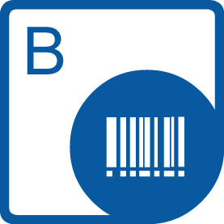

{}

****

**Welcome to the Aspose.Words for C++**

Aspose.Words for C++ is a native class library that enables C++ application developers to perform a great range of document processing tasks. Aspose.Words supports DOC, DOCX, RTF, and other formats (*see [Supported Document Formats](/words/cpp/supported-document-formats/) for details*). With Aspose.Words you can generate, modify and convert documents without utilizing Microsoft Word®.

{}

## **Aspose.Words for C++ Resources**

The following are the links to some useful resources you may need to accomplish your tasks.

- [Aspose.Words for C++ Features](/words/cpp/product-overview/)
- [Aspose.Words for C++ Release Notes](/words/cpp/release-notes/)
- [Aspose.Words for C++ Product Page](https://products.aspose.com/words/cpp/)
- [Download Aspose.Words for C++](https://downloads.aspose.com/words/cpp)
- [Install Aspose.Words for C++ NuGet Package](https://www.nuget.org/packages/Aspose.Words.Cpp/)
- [Aspose.Words for C++ API Reference Guide](https://apireference.aspose.com/words/cpp)
- [Download Examples at GitHub Repository](https://github.com/aspose-words/Aspose.words-for-C)
- [Aspose.Words for C++ Free Support Forum](https://forum.aspose.com/c/words/8)
- [Aspose.Words for C++ Paid Support Helpdesk](https://helpdesk.aspose.com/)

{}

****

**Welcome to the Aspose.Cells for C++**

Aspose.Cells for C++ is a native C++ library that enables C++ developers to create, manipulate and convert spreadsheets programmatically without requiring Office Automation or Microsoft Excel application. Aspose.Cells for C++ supports spreadsheet formats such as MS Excel 97-2003 (XLS), MS Excel 2007-2013/2016 (XLSX, XLSM, XLSB, etc.), Open Office XML and other formats. You may also render images from worksheets and convert MS Excel spreadsheet to PDF format. The API also allows you to create, manipulate and render charts and shapes. Moreover, formula calculations is another good aspect provided by component and you may utilize it.

.

{}

## **Aspose.Cells for C++ Resources**

The following are the links to some useful resources you may need to accomplish your tasks.

- [Aspose.Cells for C++ Online Documentation](/cells/cpp/)
- [Aspose.Cells for C++ Features](/cells/cpp/product-overview/)
- [Aspose.Cells for C++ Release Notes](/cells/cpp/release-notes/)
- [Aspose.Cells for C++ Product Page](https://products.aspose.com/cells/cpp/)
- [Install Aspose.Cells for C++ NuGet Package](https://www.nuget.org/packages/Aspose.Cells.CPP/)
- [Aspose.Cells for C++ API Reference Guide](https://apireference.aspose.com/cells/cpp)
- [Download Examples at GitHub Repository](https://github.com/aspose-cells/Aspose.Cells-for-C)
- [Aspose.Cells for C++ Free Support Forum](https://forum.aspose.com/c/cells/9)
- [Aspose.Cells for C++ Paid Support Helpdesk](https://helpdesk.aspose.com/)

{}

**Welcome to the Aspose.PDF for C++ Documentation Section**

Aspose.PDF for C++ is a native C++ library that enables developers to create, read and manipulate PDF documents without using Adobe Acrobat. Aspose.PDF for C++ allows developers to create forms, add/edit text, manipulate PDF pages, add annotations, handle custom fonts and much more. Here in the documentation section of Aspose.PDF for C++, you can explore all the features of the API along with the basic examples to demonstrate the implementation of those features in your C++ application.

{}

## **Aspose.PDF for C++ Resources**

The following links offer some useful resources you may need to accomplish your tasks.

- [Aspose.PDF for C++ Online Documentation](/pdf/cpp/)
- [Aspose.PDF for C++ Features](/pdf/cpp/product-overview/)
- [Aspose.PDF for C++ Release Notes](/pdf/cpp/release-notes/)
- [Aspose.PDF for C++ Product Page](https://products.aspose.com/pdf/cpp/)
- [Install Aspose.PDF for C++ NuGet Package](https://www.nuget.org/packages/Aspose.PDF.CPP/)
- [Aspose.PDF for C++ API Reference Guide](https://apireference.aspose.com/pdf/cpp)
- [Download Examples at GitHub Repository](https://github.com/aspose-pdf/Aspose.PDF-for-C)
- [Aspose.PDF for C++ Free Support Forum](https://forum.aspose.com/c/pdf/10)
- [Aspose.PDF for C++ Paid Support Helpdesk](https://helpdesk.aspose.com/)

{}

**Welcome to the Aspose.Slides for C++**

Aspose.Slides for C++ is a Microsoft PowerPoint® management API that enables C++ applications to read and write PowerPoint® documents without using Microsoft PowerPoint®. Aspose.Slides for C++ is the first and only component that provides the functionality to manage PowerPoint® documents. Aspose.Slides for C++ provides a lot of key features such as managing text, shapes, tables & animations, adding audio and video to slides, previewing slides, exporting slides to SVG, PDF format and more.

{}

## **Aspose.Slides for C++ Resources**

The following are the links to some useful resources you may need to accomplish your tasks.

- [Aspose.Slides for C++ Online Documentation](/slides/cpp/)
- [Aspose.Slides for C++ Features](/slides/cpp/features-overview/)
- [Aspose.Slides for C++ Release Notes](/slides/cpp/release-notes/)
- [Aspose.Slides for C++ Product Page](https://products.aspose.com/slides/cpp/)
- [Install Aspose.Slides for C++ NuGet Package](https://www.nuget.org/packages/Aspose.Slides.CPP/)
- [Aspose.Slides for C++ API Reference Guide](https://apireference.aspose.com/slides/cpp)
- [Download Examples at GitHub Repository](https://github.com/aspose-slides/Aspose.Slides-for-C)
- [Aspose.Slides for C++ Free Support Forum](https://forum.aspose.com/c/slides/11)
- [Aspose.Slides for C++ Paid Support Helpdesk](https://helpdesk.aspose.com/)

{}

**Welcome to Aspose.Email for C++**

Aspose.Eamil for C++ is a native C++ library that enables C++ developers to create, manipulate and convert Outlook and other popular emailing file formats. The API is independent of Office Automation or MS Outlook, and doesn't need these to be installed on the server.

The API can be used on Windows OS for working with emailing file formats.

{}

## **Aspose.Email for C++ Resources**

The following are the links to some useful resources you may need to accomplish your tasks.

- [Aspose.Email for C++ Online Documentation](/email/cpp/)
- [Aspose.Email for C++ Features](/email/cpp/features-overview/)
- [Aspose.Email for C++ Release Notes](/email/cpp/release-notes/)
- [Aspose.Email for C++ Product Page](https://products.aspose.com/email/cpp/)
- [Install Aspose.Email for C++ NuGet Package](https://www.nuget.org/packages/aspose.email.cpp.vc140/)
- [Aspose.Email for C++ API Reference Guide](https://apireference.aspose.com/email/cpp)
- [Download Examples at GitHub Repository](https://github.com/aspose-email/Aspose.Email-for-C)
- [Aspose.Email for C++ Free Support Forum](https://forum.aspose.com/c/email/12)
- [Aspose.Email for C++ Paid Support Helpdesk](https://helpdesk.aspose.com/)

{}

**Welcome to the Aspose.Tasks for C++**

Aspose.Tasks for C++ is a native class library that enables C++ applications to read and write Microsoft Project® files without using Microsoft Project®. The component provides an easy to use API for manipulating project files, saving time and money compared to developing similar features from scratch.

{}

## **Aspose.Tasks for C++ Resources**

The following are the links to some useful resources you may need to accomplish your tasks.

- [Aspose.Tasks for C++ Online Documentation](/tasks/cpp/)
- [Aspose.Tasks for C++ Features](/tasks/cpp/product-overview/)
- [Aspose.Tasks for C++ Release Notes](/tasks/cpp/release-notes/)
- [Aspose.Tasks for C++ Product Page](https://products.aspose.com/tasks/cpp/)
- [Install Aspose.Tasks for C++ NuGet Package](https://www.nuget.org/packages/Aspose.Tasks/)
- [Download Examples at GitHub Repository](https://github.com/aspose-tasks/Aspose.Tasks-for-C)
- [Aspose.Tasks for C++ API Reference Guide](https://apireference.aspose.com/tasks/cpp)
- [Aspose.Tasks for C++ Free Support Forum](https://forum.aspose.com/c/tasks/15)
- [Aspose.Tasks for C++ Paid Support Helpdesk](https://helpdesk.aspose.com/)

{}

****

**Welcome to Aspose.BarCode for C++**

Aspose.BarCode for C++ is a set of barcode generation and recognition components built to allow developers to add barcode functionality in their C++ applications. Aspose.BarCode conforms to most of the barcode standards and specifications available nowadays. Aspose.BarCode for C++ doesn't just create barcodes but it provides a complete framework to control almost everything about them. The API is easy to use, installable on different platforms and has a rich functionality as compared to other commercially available software.

{}

## **Aspose.BarCode for C++ Resources**

The following are the links to some useful resources you may need to accomplish your tasks.

- [Aspose.BarCode for C++ Online Documentation](/barcode/cpp/)
- [Aspose.BarCode for C++ Features](/barcode/cpp/product-overview/)
- [Aspose.BarCode for C++ Release Notes](/barcode/cpp/release-notes/)
- [Aspose.BarCode for C++ Product Page](https://products.aspose.com/barcode/cpp/)
- [Install Aspose.BarCode for C++ NuGet Package](https://www.nuget.org/packages/Aspose.barcode.Cpp/)
- [Aspose.BarCode for C++ API Reference Guide](https://apireference.aspose.com/barcode/cpp)
- [Aspose.BarCode for C++ Free Support Forum](https://forum.aspose.com/c/barcode/13)
- [Aspose.BarCode for C++ Paid Support Helpdesk](https://helpdesk.aspose.com/)

{}

****

**Welcome to the Aspose.Page for C++**

Aspose.Page for C++ is a reliable and standalone XPS and PostScript file manipulation and conversion API. It allows you to create, edit and convert XPS files without requiring any additional tools. API allows operations such as manipulation of document pages & elements, create vector graphics, group shapes and specifying colors in different color spaces. Furthermore, It allows the developers to convert PS and EPS files to PDF documents, raster images such as BMP, EMF, GIF, JPEG, PNG, TIFF, and more.

{}

## **Aspose.Page for C++ Resources**

The following are the links to some useful resources you may need to accomplish your tasks.

- [Aspose.Page for C++ Online Documentation](/page/cpp/)
- [Aspose.Page for C++ Features](/page/cpp/features-list/)
- [Aspose.Page for C++ Release Notes](/page/cpp/release-notes/)
- [Aspose.Page for C++ Product Page](https://products.aspose.com/page/cpp/)
- [Install Aspose.Page for C++ NuGet Package](https://www.nuget.org/packages/Aspose.Page.Cpp/)
- [Aspose.Page for C++ API Reference Guide](https://apireference.aspose.com/page/cpp)
- [Aspose.Page for C++ Free Support Forum](https://forum.aspose.com/c/page/39)
- [Aspose.Page for C++ Paid Support Helpdesk](https://helpdesk.aspose.com/)

{}

****

**Welcome to the Aspose.OCR for C++**

Aspose.OCR for C++ is a native C++ library that allows developers to add OCR functionality to their applications without requiring any additional tool or API. Aspose.OCR for C++ allows extracting text from images having different fonts and styles - saving the time and effort involved in developing an OCR solution from scratch.

{}

## **Aspose.OCR for C++ Resources**

The following are the links to some useful resources you may need to accomplish your tasks.

- [Aspose.OCR for C++ Online Documentation](/ocr/cpp/)
- [Aspose.OCR for C++ Features](/ocr/cpp/features/)
- [Aspose.OCR for C++ Release Notes](/ocr/cpp/release-notes/)
- [Aspose.OCR for C++ Product Page](https://products.aspose.com/ocr/cpp/)
- [Aspose.OCR for C++ Free Support Forum](https://forum.aspose.com/c/ocr/16)
- [Aspose.OCR for C++ Paid Support Helpdesk](https://helpdesk.aspose.com/)

{}

****

**Welcome to the Aspose.PUB for C++ Documentation Section**

Aspose.PUB for C++ is a native C++ library that allows developers to read Microsoft Public files (.pub). It also allows us to convert .pub files to PDF without the need of any other software. The API lets you work with publication files without understanding the underlying file format structure. C++ application developers can thus use the API to create rich publication files conversion applications for mass conversion of PUB files to PDF format.

{}

## **Aspose.PUB for C++ Resources**

The following links offer some useful resources you may need to accomplish your tasks.

- [Aspose.PUB for C++ Online Documentation](/pub/cpp/)
- [Aspose.PUB for C++ Features](/pub/cpp/product-overview/)
- [Aspose.PUB for C++ Release Notes](/pub/cpp/release-notes/)
- [Aspose.PUB for C++ Product Page](https://products.aspose.com/pub/cpp/)
- [Install Aspose.PUB for C++ NuGet Package](https://www.nuget.org/packages/Aspose.PUB.CPP/)
- [Aspose.PUB for C++ API Reference Guide](https://apireference.aspose.com/pub/cpp)
- [Download Examples at GitHub Repository](https://github.com/aspose-pub/Aspose.PUB-for-C)
- [Aspose.PUB for C++ Free Support Forum](https://forum.aspose.com/c/pub/40)
- [Aspose.PUB for C++ Paid Support Helpdesk](https://helpdesk.aspose.com/)

{}

**Welcome to the Aspose.Font for C++**

Aspose.Font for C++ is a font manipulation API which lets you work with several font formats. It provides the capability to load and save fonts from files as well as stream. The API lets you work with multiple font formats such as TrueType (with TrueType collections), CFF, OpenType, and Type1. It can read encoding information for all the font types for representation of mapping between character codes and glyph identifiers. C++ application developers can use the API to render any desired glyph or text. Special glyphs can be rendered by implementing interface using simple graphics functionality (move point, draw line, curve).

{}

## **Aspose.Font for C++ Resources**

The following are the links to some useful resources you may need to accomplish your tasks.

- [Aspose.Font for C++ Online Documentation](/font/cpp/)
- [Aspose.Font for C++ Features](/font/cpp/feature-list/)
- [Aspose.Font for C++ Release Notes](/font/cpp/release-notes)
- [Aspose.Font for C++ Product Page](https://products.aspose.com/font/cpp/)
- [Install Aspose.Font for C++ NuGet Package](https://www.nuget.org/packages/Aspose.Font/)
- [Aspose.Font for C++ API Reference Guide](https://apireference.aspose.com/font/cpp)
- [Aspose.Font for C++ Free Support Forum](https://forum.aspose.com/c/font)
- [Aspose.Font for C++ Paid Support Helpdesk](https://helpdesk.aspose.com/)

{}

**Welcome to the Aspose.TeX for C++**

Aspose.TeX is a C++ library for TeX files typesetting. It can present TeX input in various graphic formats like XPS, PDF, PNG, JPEG, TIFF and BMP. It also outputs tracing info like any other TeX engine does. The API provides various ways of passing TeX input and obtaining output. And, as an advanced feature, it lets you create your own TeX format if you wish to typeset a number of documents designed uniformly.

{}

## **Aspose.TeX for C++ Resources**

The following are the links to some useful resources you may need to accomplish your tasks.

- [Aspose.TeX for C++ Online Documentation](/tex/cpp/)
- [Aspose.TeX for C++ Features](/tex/cpp/feature-list/)
- [Aspose.TeX for C++ Release Notes](/tex/cpp/release-notes/)
- [Aspose.TeX for C++ Product Page](https://products.aspose.com/tex/cpp/)
- [Install Aspose.TeX for C++ NuGet Package](https://www.nuget.org/packages/Aspose.TeX.Cpp/)
- [Aspose.TeX for C++ API Reference Guide](https://apireference.aspose.com/tex/cpp)
- [Aspose.TeX for C++ Free Support Forum](https://forum.aspose.com/c/tex/47)
- [Aspose.TeX for C++ Paid Support Helpdesk](https://helpdesk.aspose.com/)
