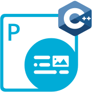

{}

**Welcome to Aspose.Total for Go via C++**

Aspose.Total for Go via C++ is a comprehensive collection of document processing APIs that combine the simplicity of Go with the power of C++ to deliver high-performance file format manipulation capabilities. These libraries enable Go developers to create, edit, convert, and process various document formats without requiring external applications or dependencies. Built with performance and ease of use in mind, Aspose.Total for Go via C++ provides native Go bindings to powerful C++ implementations, offering the best of both worlds for document processing in Go applications.

{}

{}

****

**Welcome to Aspose.PDF for Go via C++**

Aspose.PDF for Go via C++ is a versatile PDF manipulation API that enables Go developers to generate, modify, secure, and convert PDF documents within their applications without requiring Adobe Acrobat or other third-party tools. The library provides comprehensive capabilities for working with PDF files, including text extraction and manipulation, page management (adding, deleting, rotating pages), document compression, and security features such as encryption and digital signatures.

With Aspose.PDF for Go via C++, developers can create PDF documents from scratch or modify existing ones, add text, images, tables, graphs, and hyperlinks, manipulate bookmarks and annotations, and perform advanced operations like merging, splitting, or optimizing PDF files. The API also offers powerful conversion features, allowing transformation of PDFs to various formats including Word documents, Excel spreadsheets, HTML, and popular image formats like JPG and PNG. This combination of Go's simplicity and C++'s performance makes Aspose.PDF for Go via C++ an ideal solution for robust PDF processing in Go applications.

{} 

## **Aspose.PDF for Go via C++ Resources**

Following are the links to some useful resources you may need to accomplish your tasks.

- [Aspose.PDF for Go via C++ Online Documentation](https://docs.aspose.com/pdf/go-cpp/)
- [Aspose.PDF for Go via C++ Product Page](https://products.aspose.com/pdf/go-cpp/)
- [Download Aspose.PDF for Go via C++](https://releases.aspose.com/pdf/go-cpp)
- [Aspose.PDF for Go via C++ API Reference](https://reference.aspose.com/pdf/go-cpp/)
- [Aspose.PDF for Go via C++ Free Support Forum](https://forum.aspose.com/c/pdf/10)
- [Aspose.PDF for Go via C++ Paid Support Helpdesk](https://helpdesk.aspose.com/)

{}

****

**Welcome to Aspose.Cells for Go via C++**

Aspose.Cells for Go via C++ is a feature-rich spreadsheet processing library that empowers Go developers to create, read, edit, and convert Excel files within their applications without requiring Microsoft Excel. The API supports working with various Excel formats including XLS, XLSX, XLSM, XLSB, and CSV, allowing developers to manipulate spreadsheet content programmatically with ease and efficiency.

This powerful library offers comprehensive functionality for handling complex spreadsheet tasks such as formula calculation, data validation, conditional formatting, themes, styles, and charts. Developers can generate reports, perform data analysis, manipulate cell values and formatting, add or remove worksheets, and create pivot tables programmatically. Aspose.Cells for Go via C++ also provides robust conversion capabilities, enabling export of Excel files to PDF, XPS, HTML, and various image formats including JPEG, PNG, SVG, and more. By combining Go's simplicity with C++'s performance, this library delivers an optimal solution for Excel file processing in Go applications.

{} 

## **Aspose.Cells for Go via C++ Resources**

Following are the links to some useful resources you may need to accomplish your tasks.

- [Aspose.Cells for Go via C++ Online Documentation](https://docs.aspose.com/cells/go-cpp/)
- [Aspose.Cells for Go via C++ Product Page](https://products.aspose.com/cells/go-cpp/)
- [Download Aspose.Cells for Go via C++](https://releases.aspose.com/cells/go-cpp)
- [Aspose.Cells for Go via C++ API Reference](https://reference.aspose.com/cells/go-cpp/)
- [Aspose.Cells for Go via C++ Free Support Forum](https://forum.aspose.com/c/cells/9)
- [Aspose.Cells for Go via C++ Paid Support Helpdesk](https://helpdesk.aspose.com/)