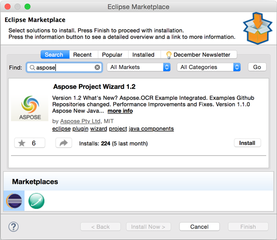
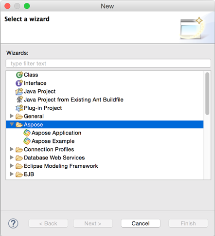

## **Installing Aspose Project Wizard for Eclipse**
Any of the following methods can be adopted for the successful installation of Aspose.Total Java for Eclipse plugin:

1. Drag and drop installation from [Eclipse Marketplace](https://marketplace.eclipse.org/search/site/aspose) to your Eclipse workspace.
1. Install from Update Site 
   1. Go to **Help** > **Install New Software...**
   1. Enter following update site URL in **Work with**: `http://cdn.aspose.com/marketplace/eclipse/asposewizardrepo`
   1. Then select "Aspose Project Wizard" and **Finish**. Accept License Agreement and Install the plugin.
1. Install via Eclipse Marketplace 
   1. Go to **Help -> Eclipse Marketplace...**
   1. Search "Aspose".
   1. Select Aspose Project Wizard to install.

## **Using**
This plugin is set of two wizards. Description of each wizard follows.

### **Aspose Project Wizard**
The new project wizard helps you setup project references properly.

1. Select APIs from the Aspose Java product line, like Aspose.Cells for Java and Aspose.Words for Java etc.
1. Click **Next** 
   This will start downloading the selected APIs from Aspose server.
1. Once an API is selected, its reference is automatically downloaded from Aspose servers and added to the project’s classpath.
1. With this plugin, you never need to manually check for new releases of Aspose APIs because whenever a new release is published, you are notified while creating projects and you can also check release notes.
### **Aspose Example Wizard**
The Aspose new file / example wizard inserts the selected sample example into the project created by the new project wizard.

1. After creating Aspose's java project using Aspose Project wizard, you can add Aspose samples using Aspose New File / Example wizard.
1. The available samples are displayed in tree format from where you can select the desired one easily. 

1. Click **Finish**
1. The selected sample is added to the current project, including source files and required data files.
1. The new project is ready to debug/evaluate, all references are automatically added.
