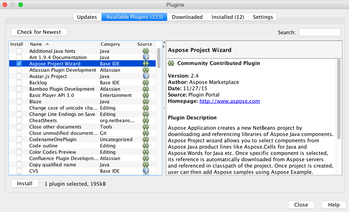
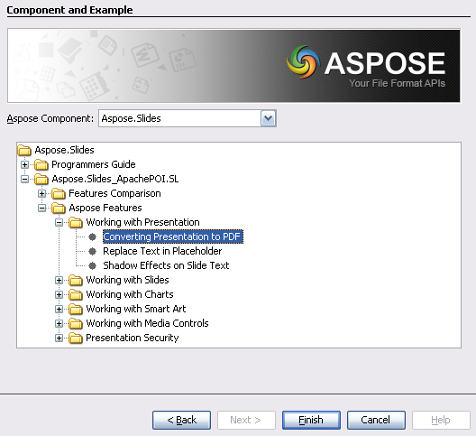

## **Installing Aspose Project Wizard for NetBeans**
Aspose Project Wizard plugin can be easily installed from the Available Plugin tab in the Plugin dialog.

- To open it, select **Plugins** from the **Tools** menu in NetBeans.

- This adds the 
**Aspose Application** in New Project wizard and  
**Aspose Example** in New File wizard of NetBeans IDE.
## **Using**
### **Using Aspose Project Wizard**
The desired [Aspose Java APIs](https://products.aspose.com/total/java/) can be selected for inclusion into your Java application when creating a new project.

1. Select **New Project**.
1. Select **Aspose Application** in the **Java** category.
1. Click **Next**. 

1. Provide a Project Name and Location just like when creating any Java application.
1. Select Aspose Components / APIs from the list and click **Finish**.
   This downloads the selected libraries. 

1. An Aspose project is created and the downloaded Aspose JARs are added to the classpath.
### **Using Aspose Examples Wizard**
Aspose Examples allow you to try out many samples provided for every Aspose APIs. To use examples, just:

1. Click **New File** in NetBeans.
1. Choose your project and then select **Aspose Example** in the **Java** category.
1. Click **Next**. 

1. Select Aspose Java components / APIs from the lists.
   The panel below shows an example of selected API in a tree format.
1. Expand the tree to select an example and click **Finish**. 

This adds Java and other required data files to the Aspose application.

1. Review the example code, compile and run. 

1. You can now test other examples and start building your own application using [Aspose APIs (Aspose.Total forJava)](https://products.aspose.com/total/java/).
### **Using Apache POI Examples**
Aspose Examples allow you to try out many samples provided for every Aspose APIs. To use examples, just:

1. Click **New File** in NetBeans.
1. Choose your project and then select **Aspose Example** in the **Java** category.
1. Click **Next**.
1. Select Aspose Java components / APIs from the lists.
   The panel will show available examples of selected API in a tree format.
1. Expand the tree to select an example and click **Finish**. 

This adds Aspose and Apache POI libraries and data files to the Aspose application.

1. Review the example code, compile and run. 
1. You can now test other examples and start building your own application using [Aspose APIs (Aspose.Total forJava)](https://products.aspose.com/total/java/).
