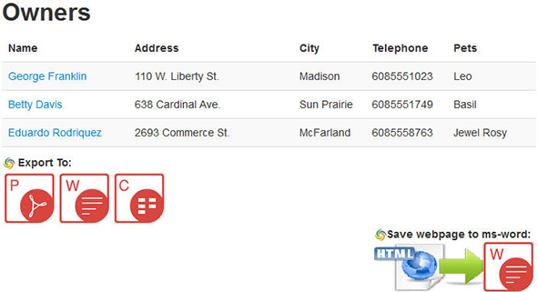
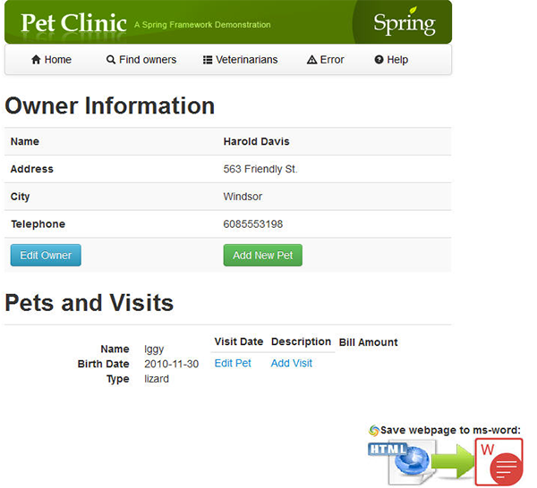
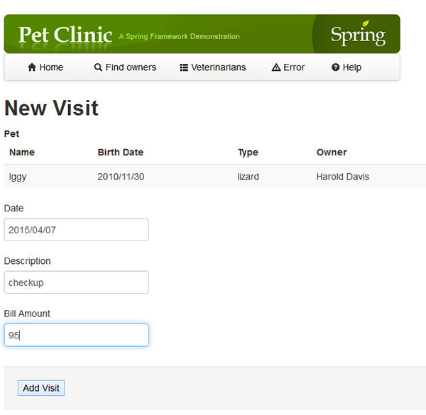
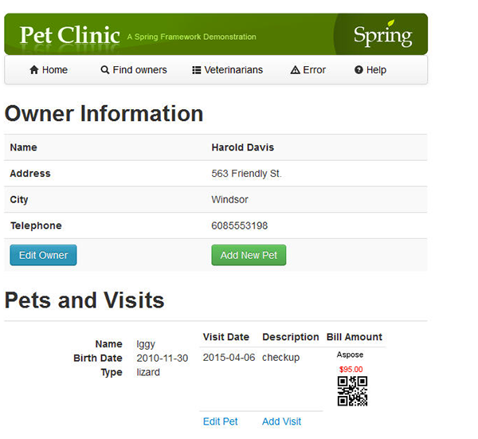

Assuming you are on the following main page of the Web application:

### **Aspose.Barcode API demonstration.**
You need to first add a Visit to an existing Pet with Bill Amount.

The Aspose.Barcode library is will display the Barcode of the entered Bill Amount.

Go into **Find Owners** then Click "**Find Owners**".

From the list of Pet Owners Click over the link of any Owner (like Harold Davis). Here you will come up with the following screen: 

Click "Add Visit" and after entering information click "**Add Visit**" as shown below: 

You will come up with the below screen showing Barcode (Using Aspose.Barcode API) for the bill amount you entered: 

