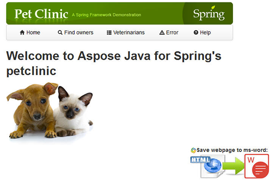
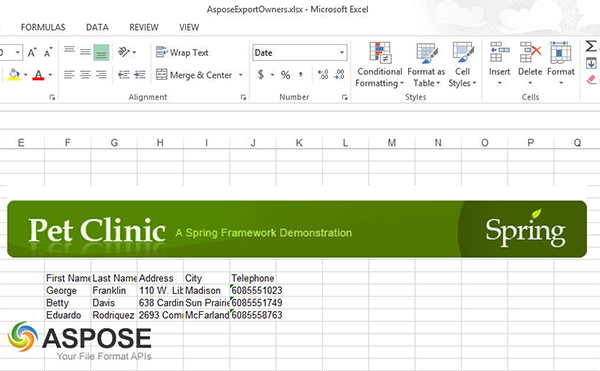

Assuming you are on the following main page of the Web application:

### **Aspose.Cells API demonstration.**
Go into **Find Owners** then Click "**Find Owners**". 

You will come up with the below screen showing Pet's Owners list. 

On the bottom of the page, you will see the Aspose Java APIs icons following "**Export To:**" label.
To export the Owners list to a MS-Excel document click on the 3rd (last) icon represented with "C". Click "**OK**" to Save the MS-Excel file.
Open the MS-Excel file saved. You will see the Owner's list exported as shown below:

