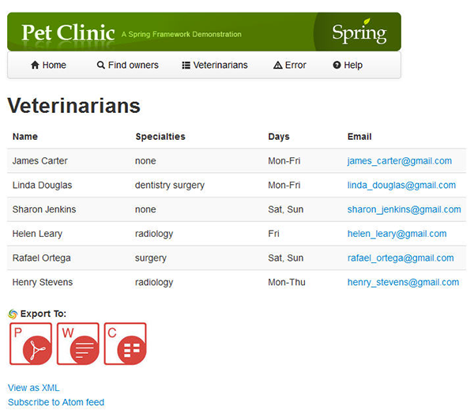
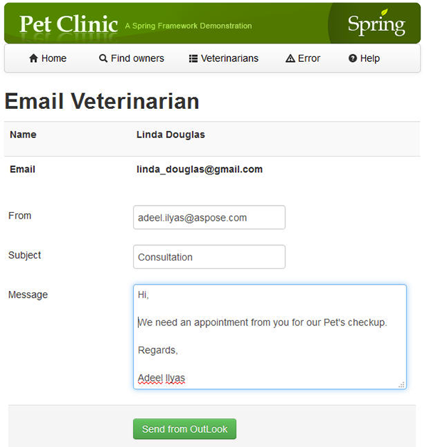

Assuming you are on the following main page of the Web application:

### **Aspose.Email API demonstration.**
Go into **Veterinarians** page. You will see the list of available Veterinarians as shown below: 

Click on the email address (like **linda_douglas@gmail.com)** of any Veterinarian under **Email** column.

You will come up with the following email form page: 

Enter your email address in **From**, **Subject** and **Message** of email.

Then click **"Send from OutLook"**. Aspose.Email API will convert the whole message including senders, receivers and subject of email into Outlook Message format.

Your installed Outlook Email client will automatically be launched and open the email message for sending the email.
