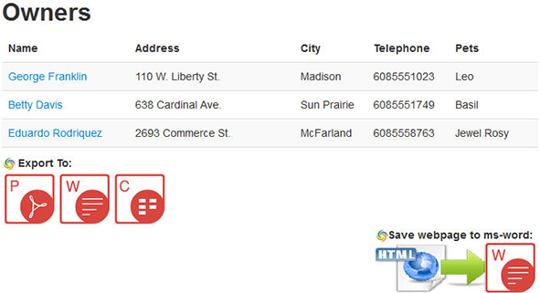
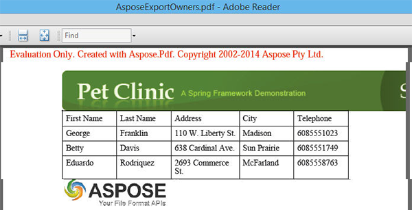

Assuming you are on the following main page of the Web application: 

### **Aspose.PDF API demonstration.**
Go into **Find Owners** then Click "**Find Owners**". 

You will come up with the below screen showing Pet's Owners list. 

On the bottom of the page, you will see the Aspose Java APIs icons following "**Export To:**" label.
To export the Owners list to a PDF document click on the first icon represented with "P". Then click "**OK**" to Save the PDF file.
Open the PDF file saved you will see the Owner's list exported as shown below:

