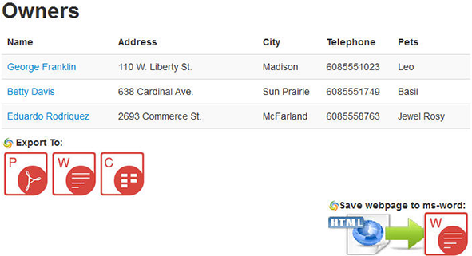

Assuming you are on the following main page of the Web application:

### **Aspose.Words API demonstration.**
Go into **Find Owners** then Click "**Find Owners**".

Here we have two options that demonstrate the Aspose.Words API

1. On the bottom of the page, you will see the Aspose Java APIs icons following "**Export To:**" label.
   To export the Owners list to a MS-Word document click on the second icon represented with "W". Then click "**OK**" to Save the MS-Word file.
   Open the MS-Word file saved you will see the Owner's list exported as shown below:

1. On the right bottom of the page, you will see the "**Save webpage to ms-word**" link.
   This option demonstrate the html to ms-word conversion feature offered by Aspose.Words api.
   Click on "**Save webpage to ms-word**" link.
   You will be asked to save html page to MS-Word file: Click "**OK**" to Save the MS-Word file.
   Open the MS-Word file saved. You will see the full Owner's list html page exported to MS-Word document as shown below:

