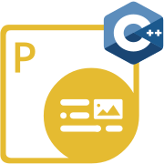
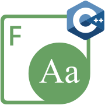

{}

**Welcome to Aspose.Total for JavaScript via C++**

Aspose.Total for JavaScript via C++ is a comprehensive collection of JavaScript libraries that leverage C++ processing power to enable browser-based document manipulation without server-side processing. These APIs allow developers to work with various file formats directly in web browsers, eliminating the need for plugins or external applications. The libraries are designed to be lightweight, secure, and feature-rich, making them ideal for building cross-platform web applications that can process documents efficiently.

{}

{}

****

**Welcome to Aspose.PDF for JavaScript via C++**

Aspose.PDF for JavaScript via C++ is a user-friendly and secure toolkit designed for working with PDF documents directly in web browsers. This lightweight yet powerful library enables developers to create, manipulate, and convert PDF files using JavaScript without requiring server-side processing. The library supports text in 26 languages, including Latin, Cyrillic scripts, and Chinese characters, making it suitable for international applications.

With Aspose.PDF for JavaScript via C++, developers can efficiently process PDFs with core features like document viewing, text extraction, content manipulation, and format conversion. The API is both scalable and feature-rich, allowing developers to craft custom JavaScript-based PDF manipulation solutions that can be easily deployed and shared across the web. Its client-side operation ensures better performance and data privacy by eliminating the need to upload sensitive documents to external servers.

{} 

## **Aspose.PDF for JavaScript via C++ Resources**

Following are the links to some useful resources you may need to accomplish your tasks.

- [Aspose.PDF for JavaScript via C++ Online Documentation](https://docs.aspose.com/pdf/javascript-cpp/)
- [Aspose.PDF for JavaScript via C++ Product Page](https://products.aspose.com/pdf/javascript-cpp/)
- [Download Aspose.PDF for JavaScript via C++](https://releases.aspose.com/pdf/javascriptcpp)
- [Aspose.PDF for JavaScript via C++ Free Support Forum](https://forum.aspose.com/c/pdf/10)
- [Aspose.PDF for JavaScript via C++ Paid Support Helpdesk](https://helpdesk.aspose.com/)

{}

****

**Welcome to Aspose.OCR for JavaScript via C++**

Aspose.OCR for JavaScript via C++ is a powerful and efficient optical character recognition library that enables developers to add text recognition capabilities to their web applications. This API allows you to extract text from scanned images, smartphone photos, screenshots, specific image areas, and scanned PDFs with just a few lines of code. The library delivers results in popular document and data exchange formats, making it easy to integrate with existing systems.

A key advantage of Aspose.OCR for JavaScript via C++ is its ability to operate completely offline, eliminating the need for an internet connection and ensuring data privacy. The library combines high recognition accuracy with optimized performance for browser environments, supporting multiple languages and fonts. Its straightforward integration process makes it an ideal solution for developers looking to implement OCR functionality in web applications without relying on server-side processing or third-party services.

{} 

## **Aspose.OCR for JavaScript via C++ Resources**

Following are the links to some useful resources you may need to accomplish your tasks.

- [Aspose.OCR for JavaScript via C++ Online Documentation](https://docs.aspose.com/ocr/javascript-cpp/)
- [Aspose.OCR for JavaScript via C++ Product Page](https://products.aspose.com/ocr/javascript-cpp/)
- [Download Aspose.OCR for JavaScript via C++](https://releases.aspose.com/ocr/javascript-cpp)
- [Aspose.OCR for JavaScript via C++ Free Support Forum](https://forum.aspose.com/c/ocr/16)
- [Aspose.OCR for JavaScript via C++ Paid Support Helpdesk](https://helpdesk.aspose.com/)

{}

****

**Welcome to Aspose.Font for JavaScript via C++**

Aspose.Font for JavaScript via C++ is a versatile font manipulation library that allows developers to work with various font formats directly within web browsers. The API offers comprehensive functionality for font management, including effortless font conversion, seamless handling of diverse formats like TTF, EOT, WOFF, CFF, and Type1, and detailed access to font metadata. This client-side solution eliminates the need for server-side processing, providing better performance and data privacy.

Developers can use Aspose.Font for JavaScript via C++ to load fonts from various sources, extract glyph information, convert between different font formats, and render text using specific fonts. The library provides tools for analyzing font properties, working with encoding information, and manipulating font data programmatically. With its lightweight design and powerful features, this API is ideal for creating web applications that require sophisticated font handling capabilities without relying on external services or plugins.

{} 

## **Aspose.Font for JavaScript via C++ Resources**

Following are the links to some useful resources you may need to accomplish your tasks.

- [Aspose.Font for JavaScript via C++ Online Documentation](https://docs.aspose.com/font/javascript-cpp/)
- [Aspose.Font for JavaScript via C++ Product Page](https://products.aspose.com/font/javascript-cpp/)
- [Download Aspose.Font for JavaScript via C++](https://releases.aspose.com/font/javascript-cpp)
- [Aspose.Font for JavaScript via C++ Free Support Forum](https://forum.aspose.com/c/font/41)
- [Aspose.Font for JavaScript via C++ Paid Support Helpdesk](https://helpdesk.aspose.com/)