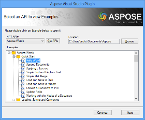
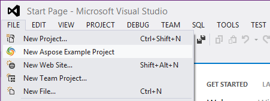
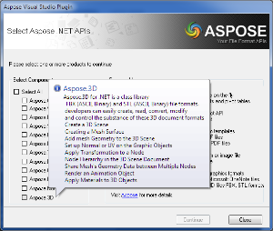
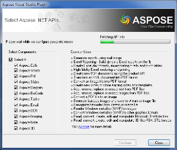
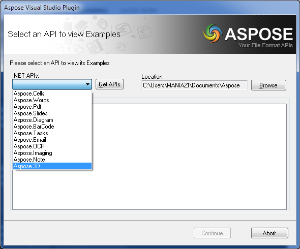
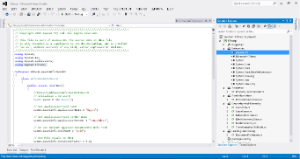

## **Introduction**
Microsoft Visual Studio is an integrated development environment (IDE) from Microsoft. It is used to develop computer programs for Microsoft Windows, as well as web sites, web applications and web services. Visual Studio uses Microsoft software development platforms such as Windows API, Windows Forms, Windows Presentation Foundation, Windows Store and Microsoft Silverlight. It can produce both native code and managed code.
### **Aspose.Total for .NET**
Aspose.Total for .NET is a compilation of every .NET component offered by Aspose. We compile it on a daily basis to ensure that it contains the most up to date versions of each of our .NET components.

Using Aspose.Total for .NET developers can create a wide range of applications, each leveraging the combined power of Aspose's .NET components.

Aspose.Total for .NET includes the following components.

- [Aspose.Cells for .NET ](https://products.aspose.com/cells/net/)
- [Aspose.Words for .NET ]https://products.aspose.com/words/net/)
- [Aspose.Pdf for .NET ](https://products.aspose.com/pdf/net/)
- [Aspose.Slides for .NET ](https://products.aspose.com/slides/net/)
- [Aspose.BarCode for .NET ](https://products.aspose.com/barcode/net/)
- [Aspose.Tasks for .NET ](https://products.aspose.com/tasks/net/)
- [Aspose.Email for .NET ](https://products.aspose.com/total/net/)
- [Aspose.Diagram for .NET ](https://products.aspose.com/diagram/net/)
- [Aspose.OCR for .NET ](https://products.aspose.com/ocr/net/)
- [Aspose.Imaging for .NET ](https://products.aspose.com/imaging/net/)
- [Aspose.Note for .NET ](https://products.aspose.com/note/net/)
- [Aspose.3D for .NET ](https://products.aspose.com/3d/net/)
### **Aspose.Total .NET for Visual Studio**
Aspose Visual Studio Plugin is a great tool to quickly download and explore Aspose .NET API examples. It saves lots of time and efforts by providing a very simple option to seamlessly select, download and open the latest example projects without having to leave your Visual Studio. The new improved 2.2 version provides the following features:

- Supports Visual Studio 2010 and Visual Studio 2012 and Visual Studio 2013.
- Easy to launch from **File** or **Tools** menu in Visual Studio
- Saves time and reduces the learning curve.
- Enables you to select and open the latest Aspose .NET API examples hosted on Github.com.
- A selected example project is automatically opened in Visual Studio with all required references set to give you a ready to run and explore environment.
- Automatically downloads the latest API libraries and examples whenever there are new updates on the server.

## **System Requirements and Supported Platforms**
In order to install and use Aspose Visual Studio Plugin you need to have one of the following Visual Studio version installed

- Visual Studio 2010, 2012, 2013

Please feel free to contact us if you find any issues in installing or using this plugin.
## **Downloading**
You can download Aspose Visual Studio Plugin from one of the following locations
- [Github ](https://github.com/aspose-total/Aspose.Total-for-.NET/releases)
## **Installing**
It is very simple and easy to install Aspose Visual Studio Plugin, please follow these simple steps

- Double click the downloaded msi file
- Follow the steps, you can simply press Next on each screen to install it using standard settings.

You will get a success dialog once the installation is completed.

**Note:** Please make sure to restart Visual Studio for the changes to take effect.
## **Using**
Once installed you can easy launch and use the interactive plugin as described below:

1. Open the plugin by selecting **File** followed by **New Aspose Example Project** in Visual Studio. 

|

| 
|
| :- |
|Aspose Visual Studio Plugin Launch from File Menu |
1. The first time you open the plugin (please proceed to step 3 otherwise) you see the API selection dialog as shown below. Please select the APIs you want to explore and then click continue. It will take few minutes to download the selected APIs and their libraries 

|

|

|
| :- | :- |
|Aspose Visual Studio Plugin API selection dialogue |Aspose Visual Studio Plugin API download screen |
1. In the Select an API to View Examples dialog, select or change the location where the example projects will be created and also select or change the APIs you want to explore. 

|

|
| :- |
|Aspose Visual Studio Plugin API Example Selection |
1. Select an example and either double-click to open it, or click **Continue** to open the example project in Visual Studio. 

|

|
| :- |
|Aspose Visual Studio Plugin example opened in visual studio |
## **Video Demo**
Please check [the video](https://www.youtube.com/watch?v=3nfMDRFj5P4) below to see the module in action.
## **Support, Extend and Contribute**
### **Support**
From the very first days of Aspose, we knew that just giving our customers good products would not be enough. We also needed to deliver good service. We are developers ourselves and understand how frustrating it is when a technical issue or a quirk in the software stops you from doing what you need to do. We're here to solve problems, not create them.

This is why we offer free support. Anyone who uses our product, whether they have bought them or are using an evaluation, deserves our full attention and respect.

You can log any issues or suggestions related to Aspose Visual Studio Plugin using any of the following platforms

- [Visual Studio Gallery - Q and A](https://docs.microsoft.com/en-us/azure/devops/marketplace/faq-extensions?view=azure-devops)
- [Github ](https://github.com/aspose-total/Aspose.Total-for-.NET/issues)

### **Extend and Contribute**
Aspose.Total .NET for Visual Studio is open source and its source code is available on the major social coding websites listed below. Developers are encouraged to download the source code and extend the functionality as per their own requirements.
#### **Source Code**
You can get the latest source code from one of the following locations

- [Github ](https://github.com/aspose-total/Aspose.Total-for-.NET)

#### **How to configure the source code**
You need to have the following installed in order to open and extend the source code

- Visual Studio 2010

Please follow these simple steps to get started

1. Download/Clone the source code.
1. Open Visual Studio 2010 and Choose **File** > **Open Project**
1. Browse to the latest source code that you have downloaded and open **AsposeVisualStudioPlugin.sln**
#### **Source code overview**
There are two projects in the solution

- AsposeVisualStudioPlugin - Contains the integration with Visual Studio, selection and automatic download of Aspose APIs and Examples.
- Installer - Wix installer project to generate msi installer file for the plugin.
