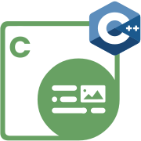
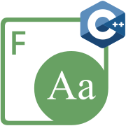

{}

**Welcome to Aspose.Total for Node.js via C++**

Aspose.Total for Node.js via C++ is a comprehensive collection of high-performance document processing APIs that combine the server-side capabilities of Node.js with the processing power of C++. This suite enables Node.js developers to create, manipulate, convert, and process various document formats without requiring external applications or dependencies. The libraries are designed to deliver optimal performance and reliability for server-side document processing tasks, making them ideal for enterprise applications, web services, and cloud-based solutions.

{}

{}

****

**Welcome to Aspose.PDF for Node.js via C++**

Aspose.PDF for Node.js via C++ is a powerful API that enables Node.js developers to create, manipulate, and process PDF documents on the server side without requiring Adobe Acrobat or other third-party tools. The library provides comprehensive capabilities for handling PDF files, including text and image extraction and insertion, document optimization, encryption and decryption, and the ability to split and merge PDF documents.

With Aspose.PDF for Node.js via C++, developers can programmatically generate PDF documents from scratch or modify existing ones, add or remove text, images, annotations, and form fields, manipulate bookmarks and attachments, and implement security features like passwords and digital signatures. The API also offers conversion capabilities for transforming PDFs to various formats including Word, Excel, HTML, and popular image formats. Built with performance in mind, this library is ideal for handling PDF processing tasks in Node.js backend applications, web services, and enterprise document management systems.

{} 

## **Aspose.PDF for Node.js via C++ Resources**

Following are the links to some useful resources you may need to accomplish your tasks.

- [Aspose.PDF for Node.js via C++ Online Documentation](https://docs.aspose.com/pdf/nodejs-cpp/)
- [Aspose.PDF for Node.js via C++ Features Overview](https://docs.aspose.com/pdf/nodejs-cpp/features-overview/)
- [Aspose.PDF for Node.js via C++ Release Notes](https://docs.aspose.com/pdf/nodejs-cpp/release-notes/)
- [Aspose.PDF for Node.js via C++ Product Page](https://products.aspose.com/pdf/nodejs-cpp/)
- [Download Aspose.PDF for Node.js via C++](https://downloads.aspose.com/pdf/nodejs-cpp)
- [Aspose.PDF for Node.js via C++ API Reference](https://reference.aspose.com/pdf/nodejs-cpp/)
- [Aspose.PDF for Node.js via C++ Free Support Forum](https://forum.aspose.com/c/pdf/10)
- [Aspose.PDF for Node.js via C++ Paid Support Helpdesk](https://helpdesk.aspose.com/)

{}

****

**Welcome to Aspose.Cells for Node.js via C++**

Aspose.Cells for Node.js via C++ is a high-performance library that enables Node.js developers to work with Excel spreadsheets without requiring Microsoft Excel installation. This powerful API allows for the generation, modification, conversion, and rendering of Excel files with exceptional speed and reliability, making it ideal for automation, cloud applications, and enterprise-level data processing tasks.

The library supports a wide range of Excel formats including XLS, XLSX, XLSM, XLSB, and CSV, providing comprehensive functionality for manipulating spreadsheet content programmatically. Developers can create complex spreadsheets from scratch, perform calculations using formulas, format cells and worksheets, add charts and images, implement data validation rules, and automate report generation. Aspose.Cells for Node.js via C++ also offers robust conversion capabilities, allowing transformation of Excel files to PDF, HTML, and various image formats. By leveraging C++ performance within Node.js applications, this API delivers scalable solutions for handling even the most demanding Excel processing tasks in server-side environments.

{} 

## **Aspose.Cells for Node.js via C++ Resources**

Following are the links to some useful resources you may need to accomplish your tasks.

- [Aspose.Cells for Node.js via C++ Online Documentation](https://docs.aspose.com/cells/nodejs-cpp/)
- [Aspose.Cells for Node.js via C++ Product Page](https://products.aspose.com/cells/nodejs-cpp/)
- [Download Aspose.Cells for Node.js via C++](https://releases.aspose.com/cells/nodejs-cpp)
- [Aspose.Cells for Node.js via C++ API Reference](https://reference.aspose.com/cells/nodejs-cpp/)
- [Aspose.Cells for Node.js via C++ Free Support Forum](https://forum.aspose.com/c/cells/9)
- [Aspose.Cells for Node.js via C++ Paid Support Helpdesk](https://helpdesk.aspose.com/)

{}

****

**Welcome to Aspose.OCR for Node.js via C++**

Aspose.OCR for Node.js via C++ is a powerful optical character recognition library that enables developers to extract text from images in Node.js applications. This API allows for accurate text extraction from various image sources including scanned documents, photographs, screenshots, and more, supporting 28 languages including complex scripts like Chinese and Hindi.

The library integrates seamlessly with Node.js server environments, making it ideal for enhancing on-premise products, web services, and serverless applications with robust OCR capabilities. Developers can process images in popular formats, apply pre-processing filters to improve recognition accuracy, and obtain results in common document and data exchange formats. With its high performance and straightforward integration, Aspose.OCR for Node.js via C++ provides a reliable solution for adding text recognition functionality to backend applications without requiring complex setups or external dependencies. The combination of Node.js flexibility and C++ processing power makes this API particularly well-suited for enterprise-level document processing systems that require both speed and accuracy.

{} 

## **Aspose.OCR for Node.js via C++ Resources**

Following are the links to some useful resources you may need to accomplish your tasks.

- [Aspose.OCR for Node.js via C++ Online Documentation](https://docs.aspose.com/ocr/nodejs-cpp/)
- [Aspose.OCR for Node.js via C++ Features Overview](https://docs.aspose.com/ocr/nodejs-cpp/features-overview/)
- [Aspose.OCR for Node.js via C++ Release Notes](https://docs.aspose.com/ocr/nodejs-cpp/release-notes/)
- [Aspose.OCR for Node.js via C++ Product Page](https://products.aspose.com/ocr/nodejs-cpp/)
- [Download Aspose.OCR for Node.js via C++](https://releases.aspose.com/ocr/nodejs-cpp)
- [Aspose.OCR for Node.js via C++ API Reference](https://reference.aspose.com/ocr/nodejs-cpp/)
- [Aspose.OCR for Node.js via C++ Free Support Forum](https://forum.aspose.com/c/ocr/16)
- [Aspose.OCR for Node.js via C++ Paid Support Helpdesk](https://helpdesk.aspose.com/)

{}

****

**Welcome to Aspose.Font for Node.js via C++**

Aspose.Font for Node.js via C++ is a versatile font management library that allows Node.js developers to work with various font formats including TrueType, WOFF, EOT, OpenType, CFF, and Type1. This API provides comprehensive functionality for loading, rendering, and saving fonts, enabling server-side font processing without requiring additional software or dependencies.

The library simplifies complex font operations by offering intuitive methods for accessing and manipulating font data. Developers can extract font metrics, glyph information, and encoding details, convert between different font formats, and render text using specific fonts in server-side applications. Aspose.Font for Node.js via C++ is designed with performance in mind, leveraging C++ efficiency while maintaining easy integration with Node.js environments. This makes it an ideal solution for applications that require sophisticated font handling capabilities, such as document generation systems, web-to-print services, and custom typesetting applications. By abstracting the complexities of font manipulation, this API allows Node.js developers to focus on creating exceptional applications without worrying about the intricacies of font handling.

{} 

## **Aspose.Font for Node.js via C++ Resources**

Following are the links to some useful resources you may need to accomplish your tasks.

- [Aspose.Font for Node.js via C++ Online Documentation](https://docs.aspose.com/font/nodejs-cpp/)
- [Aspose.Font for Node.js via C++ Features Overview](https://docs.aspose.com/font/nodejs-cpp/features-overview/)
- [Aspose.Font for Node.js via C++ Release Notes](https://docs.aspose.com/font/nodejs-cpp/release-notes/)
- [Aspose.Font for Node.js via C++ Product Page](https://products.aspose.com/font/nodejs-cpp/)
- [Download Aspose.Font for Node.js via C++](https://releases.aspose.com/font/nodejs-cpp)
- [Aspose.Font for Node.js via C++ API Reference](https://reference.aspose.com/font/nodejs-cpp/)
- [Aspose.Font for Node.js via C++ Free Support Forum](https://forum.aspose.com/c/font/41)
- [Aspose.Font for Node.js via C++ Paid Support Helpdesk](https://helpdesk.aspose.com/)