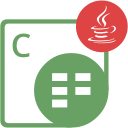
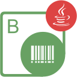

{}

**Welcome to Aspose.Cells for Node.js via Java**

Aspose.Cells for Node.js via Java presents all the useful features of Aspose.Cells for Java using Node.js. Aspose.Cells for Node.js via Java is a class library that enables you to perform a great range of spreadsheet processing tasks. Aspose.Cells for Node.js via Java is a scalable and feature-rich API that offers spreadsheet format conversion, styling of worksheets to the most granular level, chart management & rendering, and our reliable Formula Calculation Engine. Aspose.Cells for Node.js via Java supports XLS, XLSX, ODS, SpreadsheetML, CSV, Tab Delimited, HTML/MHTML, PDF, XPS and other formats. With Aspose.Cells for Node.js via Java you can generate, modify, convert and render Excel documents.

{}

## **Aspose.Cells for Node.js via Java Resources**

The following are the links to some useful resources you may need to accomplish your tasks.

- [Aspose.Cells for Java Online Documentation](https://docs.aspose.com/cells/java/) - (**Aspose.Cells for Node.js via Java** is ported from **Aspose.Cells for Java**. So, you can use the same documentation)
- [Aspose.Cells for Node.js via Java Features](https://docs.aspose.com/cells/nodejsjava/features/)
- [Aspose.Cells for Node.js via Java Release Notes](https://docs.aspose.com/cells/nodejsjava/release-notes/)
- [Aspose.Cells for Node.js via Java Product Page](https://products.aspose.com/cells/nodejs-java/)
- [Download Aspose.Cells for Node.js via Java](https://releases.aspose.com/cells/nodejs/)
- [Aspose.Cells for Node.js via Java API Reference Guide](https://reference.aspose.com/cells/nodejs/)
- [Aspose.Cells for Node.js via Java Free Support Forum](https://forum.aspose.com/)
- [Aspose.Cells for Node.js via Java Paid Support Helpdesk](https://helpdesk.aspose.com/)

{}

**Welcome to Aspose.BarCode for Node.js via Java**

Aspose.BarCode for Node.js via Java is implemented using Node.js and Java through nodejs-java bridge. It allows developers to quickly and easily add barcode generation and recognition functionality to their Node.js applications. Aspose.BarCode provides demos and working examples written in Node.js for developers to have a better understanding of our product. Using these demos, developers can quickly learn about the features provided by Aspose.BarCode. Aspose.BarCode for Node.js via Java supports the most established barcode standards and barcode specifications. It has the ability to export to following image formats: BMP, GIF, JPEG, PNG.

{}

## **Aspose.BarCode for Node.js via Java Resources**

The following are the links to some useful resources you may need to accomplish your tasks.

- [Aspose.BarCode for Java Online Documentation](https://docs.aspose.com/barcode/java/) - (**Aspose.BarCode for Node.js via Java** is ported from **Aspose.BarCode for Java**. So, you can use the same documentation)
- [Aspose.BarCode for Node.js via Java Features](https://docs.aspose.com/barcode/java/aspose-barcode-for-node-js-via-java-features/)
- [Aspose.BarCode for Node.js via Java Product Page](https://products.aspose.com/barcode/nodejs-java/)
- [Download Aspose.BarCode for Node.js via Java](https://releases.aspose.com/barcode/nodejs/)
- [Aspose.BarCode for Node.js via Java API Reference Guide](https://reference.aspose.com/barcode/nodejs/)
- [Aspose.BarCode for Node.js via Java Free Support Forum](https://forum.aspose.com/)
- [Aspose.BarCode for Node.js via Java Paid Support Helpdesk](https://helpdesk.aspose.com/)
