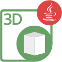

{}

**Welcome to Aspose.Cells for Node.js via Java**

_Aspose.Cells for Node.js via Java_ presents all the useful features of Aspose.Cells for Java using Node.js. Aspose.Cells for Node.js via Java is a class library that enables you to perform a great range of spreadsheet processing tasks. Aspose.Cells for Node.js via Java is a scalable and feature-rich API that offers spreadsheet format conversion, styling of worksheets to the most granular level, chart management & rendering, and our reliable Formula Calculation Engine. Aspose.Cells for Node.js via Java supports XLS, XLSX, ODS, SpreadsheetML, CSV, Tab Delimited, HTML/MHTML, PDF, XPS and other formats. With Aspose.Cells for Node.js via Java you can generate, modify, convert and render Excel documents.

{}

## **Aspose.Cells for Node.js via Java Resources**

The following are the links to some useful resources you may need to accomplish your tasks.

- [Aspose.Cells for Java Online Documentation](https://docs.aspose.com/cells/java/) - (**Aspose.Cells for Node.js via Java** is ported from **Aspose.Cells for Java**. So, you can use the same documentation)
- [Aspose.Cells for Node.js via Java Features](https://docs.aspose.com/cells/nodejsjava/features/)
- [Aspose.Cells for Node.js via Java Release Notes](https://docs.aspose.com/cells/nodejsjava/release-notes/)
- [Aspose.Cells for Node.js via Java Product Page](https://products.aspose.com/cells/nodejs-java/)
- [Download Aspose.Cells for Node.js via Java](https://releases.aspose.com/cells/nodejs/)
- [Aspose.Cells for Node.js via Java API Reference Guide](https://reference.aspose.com/cells/nodejs/)
- [Aspose.Cells for Node.js via Java Free Support Forum](https://forum.aspose.com/)
- [Aspose.Cells for Node.js via Java Paid Support Helpdesk](https://helpdesk.aspose.com/)

{}

**Welcome to Aspose.BarCode for Node.js via Java**

_Aspose.BarCode for Node.js via Java_ is implemented using Node.js and Java through nodejs-java bridge. It allows developers to quickly and easily add barcode generation and recognition functionality to their Node.js applications. Aspose.BarCode provides demos and working examples written in Node.js for developers to have a better understanding of our product. Using these demos, developers can quickly learn about the features provided by Aspose.BarCode. Aspose.BarCode for Node.js via Java supports the most established barcode standards and barcode specifications. It has the ability to export to following image formats: BMP, GIF, JPEG, PNG.

{}

## **Aspose.BarCode for Node.js via Java Resources**

The following are the links to some useful resources you may need to accomplish your tasks.

- [Aspose.BarCode for Java Online Documentation](https://docs.aspose.com/barcode/java/) - (**Aspose.BarCode for Node.js via Java** is ported from **Aspose.BarCode for Java**. So, you can use the same documentation)
- [Aspose.BarCode for Node.js via Java Features](https://docs.aspose.com/barcode/java/aspose-barcode-for-node-js-via-java-features/)
- [Aspose.BarCode for Node.js via Java Product Page](https://products.aspose.com/barcode/nodejs-java/)
- [Download Aspose.BarCode for Node.js via Java](https://releases.aspose.com/barcode/nodejs/)
- [Aspose.BarCode for Node.js via Java API Reference Guide](https://reference.aspose.com/barcode/nodejs/)
- [Aspose.BarCode for Node.js via Java Free Support Forum](https://forum.aspose.com/)
- [Aspose.BarCode for Node.js via Java Paid Support Helpdesk](https://helpdesk.aspose.com/)

{}

**Welcome to Aspose.Diagram for Node.js via Java**

_Aspose.Diagram for Node.js via Java_ API offers all the useful features of Aspose.Diagram for Java using Node.js. The API empowers you to use its powerful features of working with Visio files without the need of any other software applications. It is scalable, rich in features and provides Visio file formats conversions to images, PDF, HTML, XML and XAML formats. You can use the API to read a variety of Visio file types that can be saved as other Visio file formats. Popular file formats supported include VSD, VSS, VDW, VST, VSDX, VSSX, VSTX, VSDM, VSTM, and VSSM.

{}

## **Aspose.Diagram for Node.js via Java Resources**

The following are the links to some useful resources you may need to accomplish your tasks.

- [Aspose.Diagram for Java Online Documentation](https://docs.aspose.com/diagram/java/) - (**Aspose.Diagram for Node.js via Java** is ported from **Aspose.Diagram for Java**. So, you can use the same documentation)
- [Aspose.Diagram for Node.js via Java Release Notes](https://docs.aspose.com/diagram/nodejsjava/release-notes/)
- [Aspose.Diagram for Node.js via Java Product Page](https://products.aspose.com/diagram/nodejs-java/)
- [Download Aspose.Diagram for Node.js via Java](https://releases.aspose.com/diagram/nodejs/)
- [Aspose.Diagram for Node.js via Java API Reference Guide](https://reference.aspose.com/diagram/nodejs/)
- [Aspose.Diagram for Node.js via Java Free Support Forum](https://forum.aspose.com/)
- [Aspose.Diagram for Node.js via Java Paid Support Helpdesk](https://helpdesk.aspose.com/)

{}

**Welcome to Aspose.Slides for Node.js via Java**

_Aspose.Slides for Node.js via Java_ offers all the powerful features of Aspose.Slides for Java using Node.js. This API enables you to manipulate PowerPoint and OpenOffice presentations within your Node.js applications without requiring Microsoft PowerPoint or any other external dependencies. With Aspose.Slides for Node.js via Java, you can work with presentation elements such as slides, shapes, text, charts, tables, images, and more. The API supports comprehensive presentation processing capabilities including creating, modifying, converting and rendering presentations in various formats like PPT, PPTX, POT, POTX, PPS, PPSX and many more.

{}

## **Aspose.Slides for Node.js via Java Resources**

The following are the links to some useful resources you may need to accomplish your tasks.

- [Aspose.Slides for Java Online Documentation](https://docs.aspose.com/slides/java/) - (**Aspose.Slides for Node.js via Java** is ported from **Aspose.Slides for Java**. So, you can use the same documentation)
- [Aspose.Slides for Node.js via Java Features](https://docs.aspose.com/slides/nodejs-java/features-overview/)
- [Aspose.Slides for Node.js via Java Release Notes](https://releases.aspose.com/slides/nodejs-java/release-notes/)
- [Aspose.Slides for Node.js via Java Product Page](https://products.aspose.com/slides/nodejs-java/)
- [Download Aspose.Slides for Node.js via Java](https://releases.aspose.com/slides/nodejs-java/)
- [Aspose.Slides for Node.js via Java API Reference Guide](https://reference.aspose.com/slides/nodejs-java/)
- [Aspose.Slides for Node.js via Java Free Support Forum](https://forum.aspose.com/)
- [Aspose.Slides for Node.js via Java Paid Support Helpdesk](https://helpdesk.aspose.com/)

{}

**Welcome to Aspose.3D for Node.js via Java**

_Aspose.3D for Node.js via Java_ API provides the powerful features of Aspose.3D for Java through Node.js. This API allows developers to work with 3D file formats directly within Node.js applications. With Aspose.3D for Node.js via Java, you can create, read, convert, modify and control the substance of 3D document formats including Discreet3DS, WavefrontOBJ, FBX (ASCII, Binary), STL (ASCII, Binary), Universal3D, Collada, glTF, GLB, PLY, DirectX, and Google Draco file formats. It's a standalone API that doesn't rely on any external modeling or rendering software, enabling developers to create robust 3D processing applications with ease.

{}

## **Aspose.3D for Node.js via Java Resources**

The following are the links to some useful resources you may need to accomplish your tasks.

- [Aspose.3D for Java Online Documentation](https://docs.aspose.com/3d/java/) - (**Aspose.3D for Node.js via Java** is ported from **Aspose.3D for Java**. So, you can use the same documentation)
- [Aspose.3D for Node.js via Java Features](https://docs.aspose.com/3d/nodejs-java/product-overview/)
- [Aspose.3D for Node.js via Java Release Notes](https://releases.aspose.com/3d/nodejs-java/release-notes/)
- [Aspose.3D for Node.js via Java Product Page](https://products.aspose.com/3d/nodejs-java/)
- [Download Aspose.3D for Node.js via Java](https://releases.aspose.com/3d/nodejs-java/)
- [Aspose.3D for Node.js via Java API Reference Guide](https://reference.aspose.com/3d/nodejs-java/)
- [Aspose.3D for Node.js via Java Free Support Forum](https://forum.aspose.com/)
- [Aspose.3D for Node.js via Java Paid Support Helpdesk](https://helpdesk.aspose.com/)