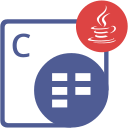

{}

**Welcome to Aspose.Cells for PHP via Java**

_Aspose.Cells for PHP via Java_ provides all the valuable features of Aspose.Cells for Java using JavaBridge. Aspose.Cells for PHP via Java is a class library that enables you to perform a great range of spreadsheet processing tasks. Aspose.Cells for PHP via Java is a scalable and feature rich API that offers spreadsheet format conversion, styling of worksheets to the most granular level, chart management & rendering, and our reliable Formula Calculation Engine. Aspose.Cells for PHP via Java supports XLS, XLSX, ODS, SpreadsheetML, CSV, Tab Delimited, HTML/MHTML, PDF, XPS and other formats. With Aspose.Cells for PHP via Java you can generate, modify, convert and render Excel documents.

{}

## **Aspose.Cells for PHP via Java Resources**

The following are the links to some useful resources you may need to accomplish your tasks.

- [Aspose.Cells for Java](https://docs.aspose.com/cells/java/)- (**Aspose.Cells for PHP via Java** is ported from **Aspose.Cells for Java**. So, you can use the same documentation)
- [Aspose.Cells for PHP via Java Features](https://docs.aspose.com/slides/php-java/features-overview/)
- [Aspose.Cells for PHP via Java Release Notes](https://docs.aspose.com/cells/phpjava/release-notes/)
- [Aspose.Cells for PHP via Java Product Page](https://products.aspose.com/cells/php-java/)
- [Download Aspose.Cells for PHP via Java](https://releases.aspose.com/cells/php/)
- [Aspose.Cells for PHP via Java API Reference Guide](https://reference.aspose.com/cells/php)
- [Aspose.Cells for PHP via Java Free Support Forum](https://forum.aspose.com/)
- [Aspose.Cells for PHP via Java Paid Support Helpdesk](https://helpdesk.aspose.com/)

{}

**Welcome to Aspose.Slides for PHP via Java**

_Aspose.Slides for PHP via Java_ provides all the valuable features of Aspose.Slides for Java using JavaBridge. Aspose.Cells for PHP via Java is a class library that enables you to perform a great range of spreadsheet processing tasks. Aspose.Cells for PHP via Java is a scalable and feature rich API that offers spreadsheet format conversion, styling of worksheets to the most granular level, chart management & rendering, and our reliable Formula Calculation Engine. Aspose.Cells for PHP via Java supports XLS, XLSX, ODS, SpreadsheetML, CSV, Tab Delimited, HTML/MHTML, PDF, XPS and other formats. With Aspose.Cells for PHP via Java you can generate, modify, convert and render Excel documents.

{}

## **Aspose.Slides for PHP via Java Resources**

The following are the links to some useful resources you may need to accomplish your tasks.

- [Aspose.Slides for Java](https://docs.aspose.com/slides/java/)- (**Aspose.Slides for PHP via Java** is ported from **Aspose.Slides for Java**. So, you can use the same documentation)
- [Aspose.Slides for PHP via Java Features](https://docs.aspose.com/slides/php-java/features-overview/)
- [Aspose.Slides for PHP via Java Release Notes](https://docs.aspose.com/slides/php-java/release-notes/)
- [Aspose.Slides for PHP via Java Product Page](https://products.aspose.com/slides/php-java/)
- [Download Aspose.Slides for PHP via Java](https://releases.aspose.com/slides/php-java/)
- [Aspose.Slides for PHP via Java API Reference Guide](https://reference.aspose.com/slides/)
- [Aspose.Slides for PHP via Java Free Support Forum](https://forum.aspose.com/)
- [Aspose.Slides for PHP via Java Paid Support Helpdesk](https://helpdesk.aspose.com/)

