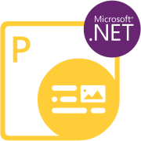
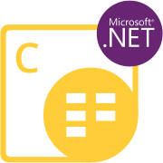
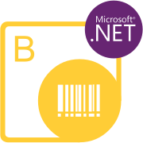
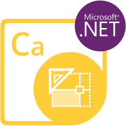
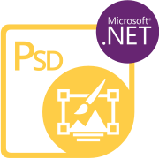
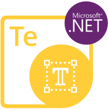

{}

****

**Welcome to Aspose.Words for Python via .NET**

Aspose.Words for Python via .NET is a class library that enables your applications to perform a great range of document processing tasks. 

Aspose.Words supports most of the popular document formats such as DOC, DOCX, RTF, HTML, Markdown, PDF, XPS, EPUB, and others.

With Aspose.Words for Python via .NET, you can generate, modify, convert, and render documents without third-party applications or Office Automation.

{} 

## **Aspose.Words for Python via .NET Resources**

Following are the links to some useful resources you may need to accomplish your tasks.

- [Aspose.Words for Python via .NET Online Documentation](https://docs.aspose.com/words/python-net/)
- [Aspose.Words for Python via .NET Features Overview](https://docs.aspose.com/words/python-net/features/)
- [Aspose.Words for Python via .NET Release Notes](https://docs.aspose.com/words/python-net/release-notes/)
- [Aspose.Words for Python via .NET Product Page](https://products.aspose.com/words/python-net/)
- [Aspose.Words for Python via .NET Free Support Forum](https://forum.aspose.com/)
- [Aspose.Words for Python via .NET Paid Support Helpdesk](https://helpdesk.aspose.com/)

{}

****

**Welcome to Aspose.Email for Python via .NET**

Aspose.Email for Python via .NET is a suite of flexible and easy to use class libraries brought together to produce a most unique and powerful email programming component. Aspose.Email saves you time and effort by allowing you to code complex message file handling into your applications quickly and easily.

Aspose.Email implements a number of network protocols, for example SMTP, MIME, POP3, IMAP; message file formats, for example EML, MSG, MHT; mail storage formats such as PST and MBOX; to allow developers to create a wide variety of email processing applications. Aspose.Email helps developers program without getting lost in the complexities of message format detail.

{} 

## **Aspose.Email for Python via .NET Resources**

Following are the links to some useful resources you may need to accomplish your tasks.

- [Aspose.Email for Python via .NET Online Documentation](https://docs.aspose.com/email/python-net/)
- [Aspose.Email for Python via .NET Features Overview](https://docs.aspose.com/email/python-net/features-overview/)
- [Aspose.Email for Python via .NET Release Notes](https://docs.aspose.com/email/python-net/release-notes/)
- [Aspose.Email for Python via .NET Product Page](https://products.aspose.com/email/python-net/)
- [Aspose.Email for Python via .NET Free Support Forum](https://forum.aspose.com/)
- [Aspose.Email for Python via .NET Paid Support Helpdesk](https://helpdesk.aspose.com/)

{}

****

**Welcome to Aspose.Slides for Python via .NET**

Aspose.Slides for Python via .NET is a class library that enables your applications to read and write PowerPoint® documents without using Microsoft PowerPoint®.

Aspose.Slides for Python via .NET is the first and only component that provides the functionality to manage PowerPoint® documents.

Aspose.Slides for Python via .NET provides a lot of key features such as managing text, shapes, tables & animations, adding audio and video to slides, previewing slides, exporting slides to SVG, PDF format and more.

{} 

## **Aspose.Slides for Python via .NET Resources**

Following are the links to some useful resources you may need to accomplish your tasks.

- [Aspose.Slides for Python via .NET Online Documentation](https://docs.aspose.com/slides/python-net/)
- [Aspose.Slides for Python via .NET Features Overview](https://docs.aspose.com/slides/python-net/features-overview/)
- [Aspose.Slides for Python via .NET Release Notes](https://docs.aspose.com/slides/python-net/release-notes/)
- [Aspose.Slides for Python via .NET Product Page](https://products.aspose.com/slides/python-net/)
- [Aspose.Slides for Python via .NET Free Support Forum](https://forum.aspose.com/)
- [Aspose.Slides for Python via .NET Paid Support Helpdesk](https://helpdesk.aspose.com/)

{}

****

**Welcome to Aspose.Diagram for Python via .NET**

Aspose.Diagram for Python via .Net API offers all the useful features of Aspose.Diagram for .Net using Python. The API empowers you to use its powerful features of working with Visio files without the need of any other software applications. It is scalable, rich in features and provides Visio file formats conversions to images, PDF, HTML, XML and XAML formats. 

You can use the API to read a variety of Visio file types that can be saved as other Visio file formats. Popular file formats supported include VSD, VSS, VDW, VST, VSDX, VSSX, VSTX, VSDM, VSTM, and VSSM.

{} 

## **Aspose.Diagram for Python via .NET Resources**

Following are the links to some useful resources you may need to accomplish your tasks.

- [Aspose.Diagram for Python via .NET Online Documentation](https://docs.aspose.com/diagram/python-net/)
- [Aspose.Diagram for Python via .NET Features Overview](https://docs.aspose.com/diagram/python-net/features/)
- [Aspose.Diagram for Python via .NET Release Notes](https://docs.aspose.com/diagram/python-net/release-notes/)
- [Aspose.Diagram for Python via .NET Product Page](https://products.aspose.com/diagram/python-net/)
- [Aspose.Diagram for Python via .NET Free Support Forum](https://forum.aspose.com/)
- [Aspose.Diagram for Python via .NET Paid Support Helpdesk](https://helpdesk.aspose.com/)
- [Download Aspose.Diagram for Python via .Net](https://releases.aspose.com/diagram/python-net/)

{}

****

**Welcome to Aspose.3D for Python via .NET**

Aspose.3D for Python via .NET is a class library project that enables your applications to connect with 3D formats automatically without 3D modeling and rendering software being installed. The Aspose.3D API lets engineers read, convert, build, alter and control the substance of the 3D document formats.

The API is user friendly and saves time and money than creating a similar solution from scratch.

{} 

## **Aspose.3D for Python via .NET Resources**

Following are the links to some useful resources you may need to accomplish your tasks.

- [Aspose.3D for Python via .NET Online Documentation](https://docs.aspose.com/3d/python-net/)
- [Aspose.3D for Python via .NET Features Overview](https://docs.aspose.com/3d/python-net/feature-list/)
- [Aspose.3D for Python via .NET Release Notes](https://docs.aspose.com/3d/python-net/release-notes/)
- [Aspose.3D for Python via .NET Product Page](https://products.aspose.com/3d/python-net/)
- [Aspose.3D for Python via .NET Free Support Forum](https://forum.aspose.com/)
- [Aspose.3D for Python via .NET Paid Support Helpdesk](https://helpdesk.aspose.com/)

{}

****

**Welcome to Aspose.Finance for Python via .NET**

Aspose.Finance, as a pure Python library provides much better performance and ease of use to manipulate finance-related formats, such as XBRL, iXBRL, OFX. The finance API is extensible, easy to use and compact and provides all common functionality so developers write less code to do common operations.

{} 

## **Aspose.Finance for Python via .NET Resources**

Following are the links to some useful resources you may need to accomplish your tasks.

- [Aspose.Finance for Python via .NET Online Documentation](https://docs.aspose.com/finance/python-net/)
- [Aspose.Finance for Python via .NET Features Overview](https://docs.aspose.com/finance/python-net/feature-list/)
- [Aspose.Finance for Python via .NET Release Notes](https://docs.aspose.com/finance/python-net/release-notes/)
- [Aspose.Finance for Python via .NET Product Page](https://products.aspose.com/finance/python-net/)
- [Aspose.Finance for Python via .NET Free Support Forum](https://forum.aspose.com/)
- [Aspose.Finance for Python via .NET Paid Support Helpdesk](https://helpdesk.aspose.com/)
- [Download Aspose.Finance for Python via .Net](https://releases.aspose.com/finance/python-net/)

{}

****

**Welcome to Aspose.PDF for Python via .NET**

Aspose.PDF for Python via .NET is a powerful API that enables you to create, manipulate, and convert PDF documents directly within your Python applications without requiring Adobe Acrobat. With this comprehensive PDF processing library, you can merge and split PDF files, convert PDFs to various image formats, and seamlessly add, update, or delete images, attachments, bookmarks, annotations, hyperlinks, watermarks, and much more. The API supports a wide range of features including PDF compression options, table creation and manipulation, custom font handling, and extended security controls, providing a complete solution for all your PDF processing needs.

{} 

## **Aspose.PDF for Python via .NET Resources**

Following are the links to some useful resources you may need to accomplish your tasks.

- [Aspose.PDF for Python via .NET Online Documentation](https://docs.aspose.com/pdf/python-net/)
- [Aspose.PDF for Python via .NET Product Page](https://products.aspose.com/pdf/python-net/)
- [Aspose.PDF for Python via .NET Free Support Forum](https://forum.aspose.com/)
- [Aspose.PDF for Python via .NET Paid Support Helpdesk](https://helpdesk.aspose.com/)

{}

****

**Welcome to Aspose.Cells for Python via .NET**

Aspose.Cells for Python via .NET is a powerful spreadsheet processing API that enables Python developers to create, manipulate, and convert Excel files without requiring Microsoft Excel. The API offers comprehensive support for Excel file formats including XLSX, XLS, XLSM, XLSB, CSV, and Tab Delimited, allowing you to work with spreadsheet data effortlessly. Beyond basic data export, Aspose.Cells for Python via .NET provides rich features for rendering worksheets to various formats such as XPS, PDF, MHTML, HTML, Plain Text, and images. With this feature-rich library, you can automate spreadsheet tasks, apply formatting, work with formulas, create charts, and much more, all within your Python applications.

{} 

## **Aspose.Cells for Python via .NET Resources**

Following are the links to some useful resources you may need to accomplish your tasks.

- [Aspose.Cells for Python via .NET Online Documentation](https://docs.aspose.com/cells/python-net/)
- [Aspose.Cells for Python via .NET Product Page](https://products.aspose.com/cells/python-net/)
- [Aspose.Cells for Python via .NET Free Support Forum](https://forum.aspose.com/)
- [Aspose.Cells for Python via .NET Paid Support Helpdesk](https://helpdesk.aspose.com/)

{}

****

**Welcome to Aspose.Imaging for Python via .NET**

Aspose.Imaging for Python via .NET is a high-performance image processing library that offers a wide range of advanced features including filtering, dithering, masking, deskewing, and various transformation capabilities. The API provides comprehensive functionality for creating, loading, manipulating, and converting images across numerous formats without requiring an external image editor. Developers can efficiently work with raster and vector images, apply various effects, draw graphics, and process images with different algorithms. The library supports common operations like resizing, cropping, rotating, and adjusting image parameters, as well as more complex tasks like color adjustment, watermarking, and format conversion, making it a complete solution for image processing in Python applications.

{} 

## **Aspose.Imaging for Python via .NET Resources**

Following are the links to some useful resources you may need to accomplish your tasks.

- [Aspose.Imaging for Python via .NET Online Documentation](https://docs.aspose.com/imaging/python-net/)
- [Aspose.Imaging for Python via .NET Product Page](https://products.aspose.com/imaging/python-net/)
- [Aspose.Imaging for Python via .NET Free Support Forum](https://forum.aspose.com/)
- [Aspose.Imaging for Python via .NET Paid Support Helpdesk](https://helpdesk.aspose.com/)

{}

****

**Welcome to Aspose.BarCode for Python via .NET**

Aspose.BarCode for Python via .NET is a robust API for barcode generation and recognition that allows developers to easily add these capabilities to their Python applications. This versatile library supports a wide range of 1D, 2D, and postal barcode symbologies, enabling both encoding and decoding functionalities. The API offers high-quality barcode image generation with customizable appearance features such as background color, bar color, image quality, rotation angle, and resolution. For recognition, the library provides advanced algorithms capable of reading barcodes at any angle from images, including those with noisy or damaged barcodes. With Aspose.BarCode for Python via .NET, developers can efficiently integrate comprehensive barcode processing capabilities into their Python projects.

{} 

## **Aspose.BarCode for Python via .NET Resources**

Following are the links to some useful resources you may need to accomplish your tasks.

- [Aspose.BarCode for Python via .NET Online Documentation](https://docs.aspose.com/barcode/python-net/)
- [Aspose.BarCode for Python via .NET Product Page](https://products.aspose.com/barcode/python-net/)
- [Aspose.BarCode for Python via .NET Free Support Forum](https://forum.aspose.com/)
- [Aspose.BarCode for Python via .NET Paid Support Helpdesk](https://helpdesk.aspose.com/)

{}

****

**Welcome to Aspose.Tasks for Python via .NET**

Aspose.Tasks for Python via .NET is a comprehensive API that allows developers to create, load, update, and convert Microsoft Project files directly within Python applications without requiring Microsoft Project or any other external software. The library provides extensive functionality for working with project files, including the ability to manage tasks, resources, and assignments, create project schedules, calculate critical paths, track progress, and apply constraints. Developers can easily manipulate project data, create Gantt charts, generate reports, and export project files to various formats such as PDF, XML, HTML, and images. With Aspose.Tasks for Python via .NET, you get a powerful solution for automating project management tasks within your Python applications.

{} 

## **Aspose.Tasks for Python via .NET Resources**

Following are the links to some useful resources you may need to accomplish your tasks.

- [Aspose.Tasks for Python via .NET Online Documentation](https://docs.aspose.com/tasks/python-net/)
- [Aspose.Tasks for Python via .NET Product Page](https://products.aspose.com/tasks/python-net/)
- [Aspose.Tasks for Python via .NET Free Support Forum](https://forum.aspose.com/)
- [Aspose.Tasks for Python via .NET Paid Support Helpdesk](https://helpdesk.aspose.com/)

{}

****

**Welcome to Aspose.OCR for Python via .NET**

Aspose.OCR for Python via .NET is a powerful optical character recognition (OCR) API that enables developers to add text recognition capabilities to their Python applications. The library allows extracting text from images in various formats such as JPEG, PNG, GIF, BMP, and TIFF, as well as from scanned PDF documents. With its advanced recognition algorithms, the API accurately detects and extracts text from images while preserving the original formatting. It supports multiple languages and offers features like noise reduction, automatic document orientation detection, and skew correction to improve recognition results. Aspose.OCR for Python via .NET provides a simple and efficient way to integrate OCR functionality into your Python applications without requiring any external software.

{} 

## **Aspose.OCR for Python via .NET Resources**

Following are the links to some useful resources you may need to accomplish your tasks.

- [Aspose.OCR for Python via .NET Online Documentation](https://docs.aspose.com/ocr/python-net/)
- [Aspose.OCR for Python via .NET Product Page](https://products.aspose.com/ocr/python-net/)
- [Aspose.OCR for Python via .NET Free Support Forum](https://forum.aspose.com/)
- [Aspose.OCR for Python via .NET Paid Support Helpdesk](https://helpdesk.aspose.com/)

{}

****

**Welcome to Aspose.CAD for Python via .NET**

Aspose.CAD for Python via .NET is a powerful API that enables Python developers to convert CAD drawings to various image formats and PDF without requiring AutoCAD or any other CAD software. The library supports working with popular CAD and BIM formats including DWG, DXF, DGN, IFC, and STL files, allowing you to load, manipulate, and process these files programmatically. With Aspose.CAD for Python via .NET, you can render specific layouts, layers, or views from CAD drawings, adjust image size and quality settings, and perform batch conversions efficiently. The API ensures high-fidelity conversion while maintaining the original designs, making it an ideal solution for CAD file processing in Python applications.

{} 

## **Aspose.CAD for Python via .NET Resources**

Following are the links to some useful resources you may need to accomplish your tasks.

- [Aspose.CAD for Python via .NET Online Documentation](https://docs.aspose.com/cad/python-net/)
- [Aspose.CAD for Python via .NET Product Page](https://products.aspose.com/cad/python-net/)
- [Aspose.CAD for Python via .NET Free Support Forum](https://forum.aspose.com/)
- [Aspose.CAD for Python via .NET Paid Support Helpdesk](https://helpdesk.aspose.com/)

{}

****

**Welcome to Aspose.ZIP for Python via .NET**

Aspose.ZIP for Python via .NET is a flexible and powerful API that enables Python developers to efficiently create, extract, update, and manipulate archive files. The library supports a wide range of compression formats including ZIP, 7Zip, RAR, TAR, GZIP, BZ2, LZ, CPIO, XZ, Z, and CAB. With Aspose.ZIP for Python via .NET, you can create new archives, add or remove files from existing archives, apply various compression levels, and secure archives with password protection. The API provides streaming capabilities for memory-efficient operations and supports advanced features like split archives and multiple compression methods. This comprehensive archive manipulation library offers a simple and efficient way to handle compressed files and folders within your Python applications.

{} 

## **Aspose.ZIP for Python via .NET Resources**

Following are the links to some useful resources you may need to accomplish your tasks.

- [Aspose.ZIP for Python via .NET Online Documentation](https://docs.aspose.com/zip/python-net/)
- [Aspose.ZIP for Python via .NET Product Page](https://products.aspose.com/zip/python-net/)
- [Aspose.ZIP for Python via .NET Free Support Forum](https://forum.aspose.com/)
- [Aspose.ZIP for Python via .NET Paid Support Helpdesk](https://helpdesk.aspose.com/)

{}

****

**Welcome to Aspose.HTML for Python via .NET**

Aspose.HTML for Python via .NET is a versatile HTML processing API that enables developers to create, modify, extract, convert, and render HTML documents directly within Python applications. The library supports various web-related formats including HTML, XHTML, SVG, EPUB, and Markdown, allowing for seamless conversion between these formats and to fixed-layout formats like PDF, XPS, and raster images (PNG, JPEG, BMP, and TIFF). Aspose.HTML for Python via .NET offers advanced features such as CSS manipulation, HTML DOM traversal, JavaScript support, and HTML Canvas implementation, providing comprehensive tools for HTML document processing. With its high-fidelity rendering engine and extensive functionality, this API is ideal for developing applications that require sophisticated HTML manipulation and conversion capabilities.

{} 

## **Aspose.HTML for Python via .NET Resources**

Following are the links to some useful resources you may need to accomplish your tasks.

- [Aspose.HTML for Python via .NET Online Documentation](https://docs.aspose.com/html/python-net/)
- [Aspose.HTML for Python via .NET Product Page](https://products.aspose.com/html/python-net/)
- [Aspose.HTML for Python via .NET Free Support Forum](https://forum.aspose.com/)
- [Aspose.HTML for Python via .NET Paid Support Helpdesk](https://helpdesk.aspose.com/)

{}

****

**Welcome to Aspose.Page for Python via .NET**

Aspose.Page for Python via .NET is a robust API for creating, editing, and converting EPS, PS, XPS, and OXPS files within Python applications without requiring any additional software. The library enables developers to work with PostScript (PS, EPS) files, converting them to PDF or various raster image formats including EMF, BMP, GIF, JPEG, PNG, and TIFF with high fidelity. For XPS files, the API provides comprehensive functionality for creating, parsing, and manipulating both new and existing XPS documents, including adding or removing pages, manipulating elements, working with canvases, paths, and glyphs, and handling document structure efficiently. Aspose.Page for Python via .NET offers a reliable solution for all your page description language processing needs.

{} 

## **Aspose.Page for Python via .NET Resources**

Following are the links to some useful resources you may need to accomplish your tasks.

- [Aspose.Page for Python via .NET Online Documentation](https://docs.aspose.com/page/python-net/)
- [Aspose.Page for Python via .NET Product Page](https://products.aspose.com/page/python-net/)
- [Aspose.Page for Python via .NET Free Support Forum](https://forum.aspose.com/)
- [Aspose.Page for Python via .NET Paid Support Helpdesk](https://helpdesk.aspose.com/)

{}

****

**Welcome to Aspose.PSD for Python via .NET**

Aspose.PSD for Python via .NET is a powerful API for creating, reading, editing, and converting Adobe Photoshop files (PSD, PSB) and Adobe Illustrator files (AI) within Python applications without requiring Adobe Photoshop or Illustrator. The library offers comprehensive functionality for working with Photoshop files, including the ability to update text and shape layers, manipulate smart objects, apply and adjust blending modes, work with layer effects, handle animations, and process vector and raster masks. Developers can efficiently read, modify, and export PSD and PSB files, create new documents from scratch, adjust color modes, compress images, and convert files to various formats such as PDF, PNG, JPEG, and TIFF, making it a complete solution for Photoshop file processing in Python applications.

{} 

## **Aspose.PSD for Python via .NET Resources**

Following are the links to some useful resources you may need to accomplish your tasks.

- [Aspose.PSD for Python via .NET Online Documentation](https://docs.aspose.com/psd/python-net/)
- [Aspose.PSD for Python via .NET Product Page](https://products.aspose.com/psd/python-net/)
- [Aspose.PSD for Python via .NET Free Support Forum](https://forum.aspose.com/)
- [Aspose.PSD for Python via .NET Paid Support Helpdesk](https://helpdesk.aspose.com/)

{}

****

**Welcome to Aspose.SVG for Python via .NET**

Aspose.SVG for Python via .NET is a comprehensive API for creating, parsing, rendering, and converting SVG (Scalable Vector Graphics) files within Python applications without requiring any additional tools. The library enables developers to load existing SVG files, modify their content programmatically, and convert them to popular formats like PDF, XPS, PNG, JPEG, BMP, and GIF with high fidelity. Aspose.SVG for Python via .NET supports advanced features such as traversing and manipulating SVG elements through DOM navigation, applying filter effects, working with vector graphics, and handling text elements. The API provides powerful rendering capabilities and precise control over the conversion process, making it an ideal choice for developing applications like SVG editors, converters, and vectorizers in Python.

{} 

## **Aspose.SVG for Python via .NET Resources**

Following are the links to some useful resources you may need to accomplish your tasks.

- [Aspose.SVG for Python via .NET Online Documentation](https://docs.aspose.com/svg/python-net/)
- [Aspose.SVG for Python via .NET Product Page](https://products.aspose.com/svg/python-net/)
- [Aspose.SVG for Python via .NET Free Support Forum](https://forum.aspose.com/)
- [Aspose.SVG for Python via .NET Paid Support Helpdesk](https://helpdesk.aspose.com/)

{}

****

**Welcome to Aspose.TeX for Python via .NET**

Aspose.TeX for Python via .NET is a versatile API for manipulating and converting TeX and LaTeX files within Python applications. The library enables developers to typeset TeX documents and render them to various output formats including PDF, XPS, PNG, JPEG, TIFF, SVG, and more with high fidelity. It supports advanced features such as creating custom TeX formats, rendering LaTeX fragments, working with various input sources and output destinations, and handling embedded resources efficiently. Aspose.TeX for Python via .NET provides intuitive syntax, comprehensive error reporting, and powerful conversion capabilities, making it an ideal solution for integrating TeX and LaTeX functionality into Python applications ranging from desktop software to web services.

{} 

## **Aspose.TeX for Python via .NET Resources**

Following are the links to some useful resources you may need to accomplish your tasks.

- [Aspose.TeX for Python via .NET Online Documentation](https://docs.aspose.com/tex/python-net/)
- [Aspose.TeX for Python via .NET Product Page](https://products.aspose.com/tex/python-net/)
- [Aspose.TeX for Python via .NET Free Support Forum](https://forum.aspose.com/)
- [Aspose.TeX for Python via .NET Paid Support Helpdesk](https://helpdesk.aspose.com/)