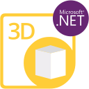

{}

****

**Welcome to Aspose.Words for Python via .NET**

Aspose.Words for Python via .NET is a class library that enables your applications to perform a great range of document processing tasks. 

Aspose.Words supports most of the popular document formats such as DOC, DOCX, RTF, HTML, Markdown, PDF, XPS, EPUB, and others.

With Aspose.Words for Python via .NET, you can generate, modify, convert, and render documents without third-party applications or Office Automation.

{} 

## **Aspose.Words for Python via .NET Resources**

Following are the links to some useful resources you may need to accomplish your tasks.

- [Aspose.Words for Python via .NET Online Documentation](/words/python-net/)
- [Aspose.Words for Python via .NET Features Overview](/words/python-net/features/)
- [Aspose.Words for Python via .NET Release Notes](/words/python-net/release-notes/)
- [Aspose.Words for Python via .NET Product Page](https://products.aspose.com/words/python-net/)
- [Aspose.Words for Python via .NET Free Support Forum](https://forum.aspose.com/)
- [Aspose.Words for Python via .NET Paid Support Helpdesk](https://helpdesk.aspose.com/)

{}

****

**Welcome to Aspose.Email for Python via .NET**

Aspose.Email for Python via .NET is a suite of flexible and easy to use class libraries brought together to produce a most unique and powerful email programming component. Aspose.Email saves you time and effort by allowing you to code complex message file handling into your applications quickly and easily.

Aspose.Email implements a number of network protocols, for example SMTP, MIME, POP3, IMAP; message file formats, for example EML, MSG, MHT; mail storage formats such as PST and MBOX; to allow developers to create a wide variety of email processing applications. Aspose.Email helps developers program without getting lost in the complexities of message format detail.

{} 

## **Aspose.Email for Python via .NET Resources**

Following are the links to some useful resources you may need to accomplish your tasks.

- [Aspose.Email for Python via .NET Online Documentation](/email/python-net/)
- [Aspose.Email for Python via .NET Features Overview](/email/python-net/features-overview/)
- [Aspose.Email for Python via .NET Release Notes](/email/python-net/release-notes/)
- [Aspose.Email for Python via .NET Product Page](https://products.aspose.com/email/python-net/)
- [Aspose.Email for Python via .NET Free Support Forum](https://forum.aspose.com/)
- [Aspose.Email for Python via .NET Paid Support Helpdesk](https://helpdesk.aspose.com/)

{}

****

**Welcome to Aspose.Slides for Python via .NET**

Aspose.Slides for Python via .NET is a class library that enables your applications to read and write PowerPoint® documents without using Microsoft PowerPoint®.

Aspose.Slides for Python via .NET is the first and only component that provides the functionality to manage PowerPoint® documents.

Aspose.Slides for Python via .NET provides a lot of key features such as managing text, shapes, tables & animations, adding audio and video to slides, previewing slides, exporting slides to SVG, PDF format and more.

{} 

## **Aspose.Slides for Python via .NET Resources**

Following are the links to some useful resources you may need to accomplish your tasks.

- [Aspose.Slides for Python via .NET Online Documentation](/slides/python-net/)
- [Aspose.Slides for Python via .NET Features Overview](/slides/python-net/features-overview/)
- [Aspose.Slides for Python via .NET Release Notes](/slides/python-net/release-notes/)
- [Aspose.Slides for Python via .NET Product Page](https://products.aspose.com/slides/python-net/)
- [Aspose.Slides for Python via .NET Free Support Forum](https://forum.aspose.com/)
- [Aspose.Slides for Python via .NET Paid Support Helpdesk](https://helpdesk.aspose.com/)

{}

****

**Welcome to Aspose.3D for Python via .NET**

Aspose.3D for Python via .NET is a class library project that enables your applications to connect with 3D formats automatically without 3D modeling and rendering software being installed. The Aspose.3D API lets engineers read, convert, build, alter and control the substance of the 3D document formats.

The API is user friendly and saves time and money than creating a similar solution from scratch.

{} 

## **Aspose.3D for Python via .NET Resources**

Following are the links to some useful resources you may need to accomplish your tasks.

- [Aspose.3D for Python via .NET Online Documentation](/3d/python-net/)
- [Aspose.3D for Python via .NET Features Overview](/3d/python-net/feature-list/)
- [Aspose.3D for Python via .NET Release Notes](/3d/python-net/release-notes/)
- [Aspose.3D for Python via .NET Product Page](https://products.aspose.com/3d/python-net/)
- [Aspose.3D for Python via .NET Free Support Forum](https://forum.aspose.com/)
- [Aspose.3D for Python via .NET Paid Support Helpdesk](https://helpdesk.aspose.com/)
