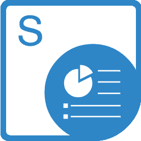

{} 

**Welcome to Aspose.Words for SharePoint**

Aspose.Words for SharePoint makes it possible to convert and combine word documents within Microsoft SharePoint applications. It supports format conversion with high fidelity, and can be used to generate reports with data from SQL databases, XML files or SharePoint lists.

{} 

## **Aspose.Words for SharePoint Resources**

The following are the links to some useful resources you may need to accomplish your tasks.

- [Aspose.Words for SharePoint Online Documentation](/words/sharepoint/)
- [Aspose.Words for SharePoint Features](/words/sharepoint/features/)
- [Aspose.Words for SharePoint Release Notes](/words/sharepoint/release-notes/)
- [Aspose.Words for SharePoint Product Page](https://products.aspose.com/words/sharepoint)
- [Download Aspose.Words for SharePoint](https://downloads.aspose.com/words/sharepoint)
- [Aspose.Words for SharePoint Free Support Forum](https://forum.aspose.com/c/words)
- [Aspose.Words for SharePoint Paid Support Helpdesk](https://helpdesk.aspose.com/)

{} 

**Welcome to Aspose.Cells for SharePoint**

Aspose.Cells for SharePoint is a flexible solution supporting spreadsheet conversion that makes it possible to convert MS Excel documents within the Microsoft SharePoint applications.

{} 

## **Aspose.Cells for SharePoint Resources**

The following are the links to some useful resources you may need to accomplish your tasks.

- [Aspose.Cells for SharePoint Online Documentation](/cells/sharepoint/)
- [Aspose.Cells for SharePoint Features](/cells/sharepoint/features/)
- [Aspose.Cells for SharePoint Release Notes](/cells/sharepoint/release-notes/)
- [Aspose.Cells for SharePoint Product Page](https://products.aspose.com/cells/sharepoint)
- [Download Aspose.Cells for SharePoint](https://downloads.aspose.com/cells/sharepoint)
- [Aspose.Cells for SharePoint Free Support Forum](https://forum.aspose.com/c/cells)
- [Aspose.Cells for SharePoint Paid Support Helpdesk](https://helpdesk.aspose.com/)

{} 

**Welcome to Aspose.PDF for SharePoint**

Aspose.PDF for SharePoint is a solution that allows the users to export lists, list items and SharePoint Wiki pages to the PDF file format.

{} 

## **Aspose.PDF for SharePoint Resources**

The following are the links to some useful resources you may need to accomplish your tasks.

- [Aspose.PDF for SharePoint Online Documentation](/pdf/sharepoint/)
- [Aspose.PDF for SharePoint Features](/pdf/sharepoint/features/)
- [Aspose.PDF for SharePoint Release Notes](/pdf/sharepoint/release-notes/)
- [Aspose.PDF for SharePoint Product Page](https://products.aspose.com/pdf/sharepoint)
- [Download Aspose.PDF for SharePoint](https://downloads.aspose.com/pdf/sharepoint)
- [Aspose.PDF for SharePoint Free Support Forum](https://forum.aspose.com/c/pdf)
- [Aspose.PDF for SharePoint Paid Support Helpdesk](https://helpdesk.aspose.com/)

{}

**Welcome to Aspose.Slides for SharePoint**

Aspose.Slides for SharePoint is a flexible solution that makes it possible to convert PowerPoint® documents within Microsoft SharePoint Sites.

{} 

## **Aspose.Slides for SharePoint Resources**

The following are the links to some useful resources you may need to accomplish your tasks.

- [Aspose.Slides for SharePoint Online Documentation](/slides/sharepoint/)
- [Aspose.Slides for SharePoint Features](/slides/sharepoint/features/)
- [Aspose.Slides for SharePoint Release Notes](/slides/sharepoint/release-notes/)
- [Aspose.Slides for SharePoint Product Page](https://products.aspose.com/slides/sharepoint)
- [Download Aspose.Slides for SharePoint](https://downloads.aspose.com/slides/sharepoint)
- [Aspose.Slides for SharePoint Free Support Forum](https://forum.aspose.com/c/slides)
- [Aspose.Slides for SharePoint Paid Support Helpdesk](https://helpdesk.aspose.com/)

{}

**Welcome to Aspose.Email for SharePoint**

Aspose.Email for SharePoint is a flexible solution for converting email files and synchronizing emails from within Microsoft SharePoint applications.

This manual describes Aspose.Email for SharePoint's [features](/email/sharepoint/features/), [installation](/email/sharepoint/installing-aspose-email-for-sharepoint/), [licensing](/email/sharepoint/license-aspose-email-for-sharepoint), settings and [common uses](/email/sharepoint/overview/).

{} 

## **Aspose.Email for SharePoint Resources**

The following are the links to some useful resources you may need to accomplish your tasks.

- [Aspose.Email for SharePoint Online Documentation](/email/sharepoint/)
- [Aspose.Email for SharePoint Features](/email/sharepoint/features/)
- [Aspose.Email for SharePoint Product Page](https://products.aspose.com/email/sharepoint)
- [Download Aspose.Email for SharePoint](https://downloads.aspose.com/email/sharepoint)
- [Aspose.Email for SharePoint Free Support Forum](https://forum.aspose.com/c/email)
- [Aspose.Email for SharePoint Paid Support Helpdesk](https://helpdesk.aspose.com/)

{}

**Welcome to Aspose.BarCode for SharePoint**

Aspose.BarCode for SharePoint is a flexible solution that allows you to add barcode type columns to SharePoint lists.

Aspose.BarCode for SharePoint is designed to be used with Microsoft SharePoint Server 2010. There are no additional system requirements.

{} 

## **Aspose.BarCode for SharePoint Resources**

The following are the links to some useful resources you may need to accomplish your tasks.

- [Aspose.BarCode for SharePoint Online Documentation](/barcode/sharepoint/)
- [Aspose.BarCode for SharePoint Features](/barcode/sharepoint/features/)
- [Aspose.BarCode for SharePoint Product Page](https://products.aspose.com/barcode/sharepoint)
- [Download Aspose.BarCode for SharePoint](https://downloads.aspose.com/barcode/sharepoint)
- [Aspose.BarCode for SharePoint Free Support Forum](https://forum.aspose.com/c/barcode)
- [Aspose.BarCode for SharePoint Paid Support Helpdesk](https://helpdesk.aspose.com/)

{}

**Welcome to the Aspose.Imaging for SharePoint**

Aspose.Imaging for SharePoint is a solution that allows the users to convert images to other image formats and edit them by resizing, rotating and flipping.

{} 

## **Aspose.Imaging for SharePoint Resources**

The following are the links to some useful resources you may need to accomplish your tasks.

- [Aspose.Imaging for SharePoint Online Documentation](/imaging/sharepoint/)
- [Aspose.Imaging for SharePoint Features](/imaging/sharepoint/features/)
- [Aspose.Imaging for SharePoint Release Notes](/imaging/sharepoint/release-notes/)
- [Aspose.Imaging for SharePoint Product Page](https://products.aspose.com/imaging/sharepoint)
- [Download Aspose.Imaging for SharePoint](https://downloads.aspose.com/imaging/sharepoint)
- [Aspose.Imaging for SharePoint Free Support Forum](https://forum.aspose.com/c/imaging)
- [Aspose.Imaging for SharePoint Paid Support Helpdesk](https://helpdesk.aspose.com/)
